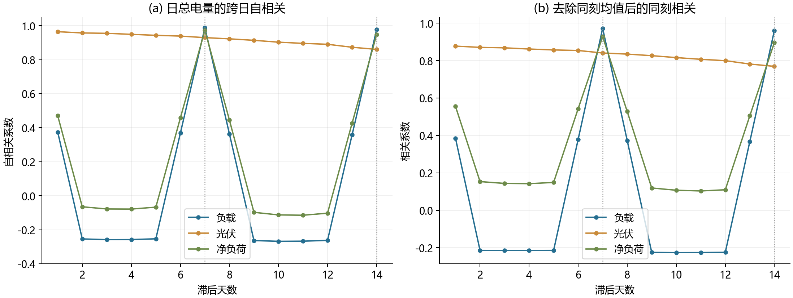
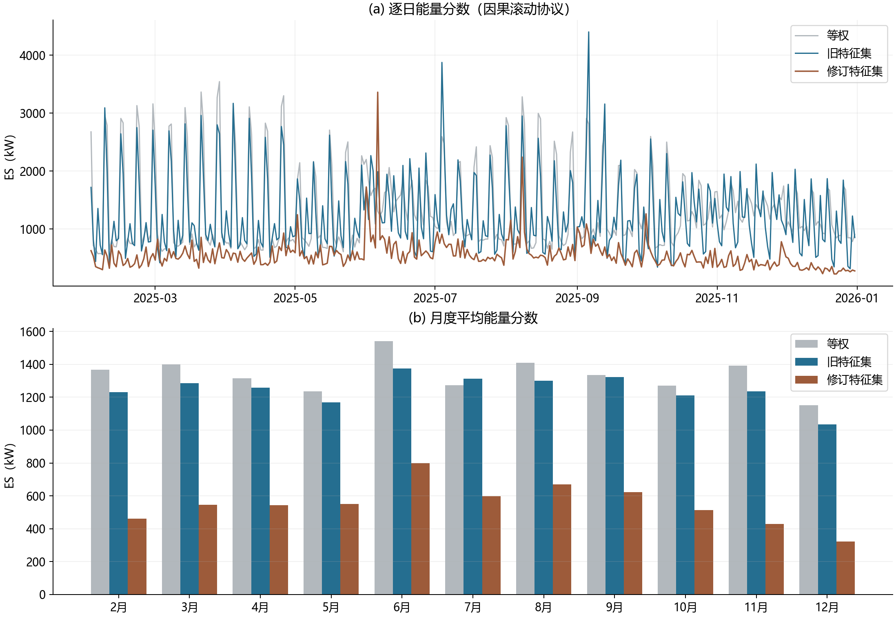

## 问题二：xxx
  
### 问题分析
  
#### 问题二问题重述
（问题官方本体参照ProblemC文件夹下文件）
问题 2 若每天的电价相同，而小区负载和光伏发电功率随时间变化，且微网提供的电能不可低于小区负载，如果低于负载，需向外网紧急购电，其电价是交易时刻电价的 5 倍。除紧急购电费用外，其他时间段的购电费用均按计划购电量计算。请在每天 0:00 制定微网当天的计划购电策略。

根据附件 1 中的电价和附件 2 中的数据，在每天 0:00 制定当天的计划购电策略。在论文中按表 1 和表 2 的格式给出表 3 中指定日期的结果，按表 3 的格式给出紧急购电的结果，并将完整的购电策略保存到文件 result2.xlsx 中（模板文件见附件 5）。

表 3 微网在指定日期的紧急购电量

<table><tr><td colspan="2">2025.3.20</td><td colspan="2">2025.6.21</td><td colspan="2">2025.9.23</td><td colspan="2">2025.12.21</td></tr><tr><td>时间段</td><td>购电量</td><td>时间段</td><td>购电量</td><td>时间段</td><td>购电量</td><td>时间段</td><td>购电量</td></tr><tr><td></td><td></td><td></td><td></td><td></td><td></td><td></td><td></td></tr><tr><td></td><td></td><td></td><td></td><td></td><td></td><td></td><td></td></tr><tr><td></td><td></td><td></td><td></td><td></td><td></td><td></td><td></td></tr></table>

#### 问题分析与类型识别

##### Problem 

**与问题一的差异。** 问题二中电价曲线 $P_t$ 每日重复且完全已知，不确定性全部来自负载与光伏。按题意"请在每天 0:00 制定微网当天的计划购电策略"，制定第 $d$ 天的计划时，当天的 $L_{d,t}, R_{d,t}$ 尚未揭晓，决策只能依据历史数据 $\{L_{j,t}, R_{j,t}: j<d\}$，建模不得引入前视偏差。计划不当的代价是**不对称**的：买少了，缺口电量须以 $5P_t$ 紧急购入；买多了，计划电费 $P_tG_{d,t}$ 照常结算，多余电量只能存入储能或弃置。此外，问题一"0:00 与 24:00 储电量相同"的循环约束在问题二中不再出现，储能状态改为跨日链式衔接，$S_{d+1,1}=S_{d,145}$。

**决策的时序结构。** 0:00 时未来未知、白随后事实量揭晓后需要考虑是否紧急购电，这一信息结构把决策变量分成两个阶段：计划购电量 $G_{d,t}$ 是第一阶段变量，在 0:00 一次性确定，对所有可能的明天取同一值，即满足非预期性；储能调度 $C_{d,t},D_{d,t}$、紧急购电 $E_{d,t}$ 与弃置 $W_{d,t}$ 是第二阶段变量，允许在揭晓后针对实际情形见招拆招。

**类型识别。** 单时段观察，本题具有报童问题的结构：缺货成本为 $4P_t$，过剩成本为 $P_t$，最优计划应定在净负载分布的某分位数而非均值上。但储能递推把 144 个时段耦合成整体，单时段的解析结论不再够用，因此本题对齐为**带储能跨时段耦合的多时段报童问题，形式化为两阶段随机线性规划**，第 $d$ 天的模型骨架为

$$
\min \;\; \sum_{t \in \mathcal{T}} P_{t} G_{d,t} + \mathbb{E} \left[ \sum_{t \in \mathcal{T}} 5 P_{t} E_{d,t} \right]
$$

其中紧急购电量 $E_{d,t}$ 是随机变量，依赖白天揭晓的真实负载与光伏，期望对明日净负载曲线的联合分布而取。

**一个假设与一个挑战。** 这样建模引入了一个假设与一个挑战。

假设是**跨日近视**：目标函数只覆盖当天，不包含日末储能对次日的价值，即终端价值项 $\theta_d^{\omega}$ 不进入目标函数。该假设的严谨表述为：若目标含 $\sum_{\omega}\pi_{d,\omega}\theta_d^{\omega}$ 的远视模型与上述近视基线在全年回测下的 $C_{\mathrm{official}}$ 差异不显著，则接受跨日近视假设。先验依据是电价低谷恰好横跨日界，22:00 至次日 5:00 约 0.42 元/kWh，跨日搬运的电随时可在凌晨低价补回，日末储能的边际价值被封顶在低谷价附近。验证方案见模型验证部分。

挑战是**期望无法精确计算**：期望的对象是 144 维的净负载联合分布，真实分布未知，只能由有限历史数据推断。

**期望的估计：场景化随机规划。** 以若干历史日的完整曲线作为情景集合 $\Omega_d$，用经验期望 $\sum_{\omega\in\Omega_d}\pi_{d,\omega}[\,\cdot\,]$ 近似真实期望。情景构造遵循三条由数据特征直接推出的规则：其一，以天为单位整体采样，因为净负载预测残差在日内高度相关，相邻时段相关系数达 0.85 以上，逐时段独立抽样会虚构时段之间的对冲、系统性低估紧急购电风险；其二，按季节条件化，$\mathcal{H}_d$ 只含与 $d$ 同季节的历史日，因为光伏与净负载存在显著季节差异，净负载日均值 12 月约为 5 月的两倍；其三，无前视偏差，$\mathcal{H}_d$ 只含 $j<d$ 的历史日。

工作注记：上述数据论断，如残差日内相关、月度季节差异等，须在数据预处理章节配置图表佐证，配图后此处改为引用图号。

### 数据预处理
（后续要给出上文关于“数据分析的表述”的证据时，再处理该章节）
  
### 模型建立

#### 符号设定

时间离散化与储能参数沿用 `notation.md`：$\mathcal{T}=\{1,\ldots,144\}$，$\mathcal{T}^+=\{1,\ldots,145\}$，$\Delta=\frac16\,\mathrm h$，$S^{\min}=1200$，$S^{\max}=10800$ kWh，$\bar e=5000\Delta\approx833.33$ kWh，$\eta_c=\eta_d=0.9$，$P_t$ 为附件1的固定日内电价。

统一记号规则：**带上标 $\omega$ 的量为情景设想值，不带 $\omega$ 的量为实际值**（附件2实测数据或模型执行后的真实路径）；计划购电量 $G_{d,t}$ 故意不带 $\omega$，它在 0:00 必须定死、对所有情景取同一值，"没有 $\omega$"本身就是非预期性约束的可见标记。预测量若引入则加 $\widehat{\cdot}$。

问题二在 `notation.md` 基础上新定义或改形的主要符号：

| 符号 | 含义 | 单位或取值 |
|---|---|---|
| $d,\mathcal{D}$ | 日期指标及其集合（数据域） | $\mathcal{D}$ 为 2025 全年 365 天 |
| $\mathcal{D}_{\mathrm{out}}$ | 输出日期集合 | 2025-02-01 至 12-31，共 334 天 |
| $\mathcal{H}_d$ | 第 $d$ 天的候选历史池 | $\{j\in\mathcal{D}:j<d,\ j\text{ 与 }d\text{ 同季节}\}$ |
| $\omega,\Omega_d$ | 情景指标（$\omega$ 本身就是历史日日期）及第 $d$ 天的情景集合 | $\Omega_d\subseteq\mathcal{H}_d$，以整天为单位抽样 |
| $\pi_{d,\omega}$ | 情景权重 | $\ge0$，$\sum_{\omega\in\Omega_d}\pi_{d,\omega}=1$，基线取等权 |
| $L_{d,t}^{\omega},R_{d,t}^{\omega}$ | 情景 $\omega$ 所对应历史日在时段 $t$ 的负载、光伏电量 | kWh |
| $N_{d,t}^{\omega}$ | 情景 $\omega$ 下时段 $t$ 的净负荷，$N_{d,t}^{\omega}=L_{d,t}^{\omega}-R_{d,t}^{\omega}$ | kWh |
| $G_{d,t}$ | 时段 $t$ 的计划购电量，第一阶段决策变量 | kWh |
| $G^{\mathrm{c}}_{d,t}$ | 计划购电量中划给储能充电的份额，同为第一阶段变量 | kWh |
| $\Delta_{d,t}$ | 时段 $t$ 的期望净负荷缺口 $\sum_\omega\pi_{d,\omega}\max(0,L^{\omega}_{d,t}-R^{\omega}_{d,t})$ | kWh |
| $C_{d,t}^{\omega},D_{d,t}^{\omega}$ | 情景 $\omega$ 下交流母线侧充电量、放电量，第二阶段变量 | kWh |
| $S_{d,t}^{\omega}$ | 情景 $\omega$ 下时段 $t$ 开始时的储电量，$t\in\mathcal{T}^+$ | kWh |
| $E_{d,t}^{\omega}$ | 情景 $\omega$ 下时段 $t$ 的紧急购电量，电价为 $5P_t$ | kWh |
| $W_{d,t}^{\omega}$ | 情景 $\omega$ 下时段 $t$ 的弃置电量，弃光与已购未利用合并计入 | kWh |
| $L_{d,t},R_{d,t},S_{d,t},C_{d,t},D_{d,t},E_{d,t},W_{d,t}$ | 实际值：实测负载、光伏与实际执行路径，即填报 result2 的量 | kWh |
| $V_{d+1}(s)$ | 终端价值函数：次日以储能 $s$ 开局的最小期望费用 | 元 |
| $\theta_d^{\omega}$ | 终端价值的分段线性化辅助变量 | 元 |
| $a_{d,q},b_{d,q}$ | 终端价值$\theta_d^{\omega}$第 $q$ 条切线的斜率与截距 | 元/kWh，元；$q=0,\ldots,Q-1$，$a_{d,q}\le0$ |
| $C_{\mathrm{official}}$ | 全年官方结算费用，$\sum_{d\in\mathcal{D}_{\mathrm{out}}}\sum_t(P_tG_{d,t}+5P_tE_{d,t})$ | 元 |

#### 模型假设
1. **跨日近视**：储能的跨日影响有限，即将储能站电量在第二日消耗的边际回报处处不超过今日释放的即时收益；
2. **已购未利用合法**：计划购电按量结算、无需用尽，允许 $W_{d,t}^{\omega}>0$，即已购电量可以弃置；
3. **紧急电不进储能**：紧急购电只用于补足负载缺口，不作为储能充电的来源。该性质**不能**由 $5P_t>P_t$ 自动保证：跨时段被比较的是低价时段的 $5P_t$ 与高价时段的 $5P_{t'}$，储能让两者之间的套利成立；又因充电量 $C_{d,t}^{\omega}$ 是情景特定变量、计划购电量 $G_{d,t}$ 是全情景共享变量，模型有动机用"情景内的廉价紧急电充电"替代"提高共享计划"。故本模型把它写成显式线性约束（形式化建模中的 C11、C12），而非留待事后核验；
4. **购电无功率上限**：题面未对计划购电与紧急购电设功率限制，模型不设；
5. **情景代表性**：明天与 $\mathcal{H}_d$ 中同季节历史日近似可交换，$\Omega_d$ 的经验分布可作为明日净负载条件分布的近似。

#### 模型重要假设合理性的简单论证
上述假设最重要的便是“储能的跨日影响有限”假设，这里通过数据做简要假设合理性论证。  
工作注记：该假设本计划以 $V(s)$ 扫描实验验证，现以口头论证代替，实验设计留待模型验证章节按时间决定是否补做。  
记两个模型的最优计划如下：  
$$G_{d,t}^{(0)} = \arg\min \sum_{t \in \mathcal{T}} P_t G_{d,t} + \sum_{\omega \in \Omega_d} \pi_{d,\omega} \sum_{t \in \mathcal{T}} 5 P_t E_{d,t}^{\omega}$$
$$G_{d,t}^{(\theta)} = \arg\min \sum_{t \in \mathcal{T}} P_t G_{d,t} + \sum_{\omega \in \Omega_d} \pi_{d,\omega} \left( \sum_{t \in \mathcal{T}} 5 P_t E_{d,t}^{\omega} + \theta_d^{\omega} \right)$$
其中 $G_{d,t}^{(0)}$ 是近视模型的最优计划，也即只考虑单期优化的模型，目标函数不含终端价值；$G_{d,t}^{(\theta)}$ 是远视模型,即考虑储能跨日影响的模型的最优计划，目标函数含 $\theta$   
因此我们可将该假设形式化表述为：  
存在事先给定的容忍度 $\varepsilon$，使得
$$
\frac{C_{\text{official}}(\{G_{d,t}^{(0)}\}) - C_{\text{official}}(\{G_{d,t}^{(\theta)}\})}{C_{\text{official}}(\{G_{d,t}^{(\theta)}\})} \le \varepsilon
$$
即放弃日末储能的明日价值，全年真实结算费用的相对损失不超过 $\varepsilon$。  

该假设的合理性可由日末储能边际价值与电价的比较作出论证。终端价值切线的斜率 $-a_{d,q}\ge0$ 表示 24:00 储能中多留一度电在次日的边际收益，而远视模型与近视模型的分歧恰恰只可能出现在日末：近视模型在 22:00 到 24:00 的低谷窗口倾向于把储能放空，因为放出一度电就省 $P_t$ 元；远视模型是否纠正这一行为，取决于留下的回报 $-a_{d,q}$ 能否超过放掉的收益。于是假设成立的一个充分条件为
$$
\max_{q=0,\ldots,Q-1}\big(-a_{d,q}\big) \;\lesssim\; \min_{t\in\mathcal{T}^{\mathrm{晚}}} P_t, \qquad \mathcal{T}^{\mathrm{晚}}=\{133,\ldots,144\}
$$
即“留给明天”的边际回报处处不超过“今天放掉”的即时收益。

对该条件的两端分别用数据估计。左端，日末储能中一度电在明天最现实的替代品是凌晨低谷重新购入：附件 1 的电价低谷恰好横跨日界，22:00 至次日 5:00 约 0.42 元/kWh，而充满可用容量 9600 kWh 只需约 12 个时段即两小时，替代供给充足，因此日末储能的边际价值被封顶在 0.42 元附近。右端，附件 1 在 22:00 到 24:00 的电价为 0.418 到 0.427 元/kWh。两端几乎相等，意味着最优解处在“放掉”与“留下”近乎无差异的临界上，两个模型的日末行为趋于一致，假设 A 由此获得支持。

另有两点佐证。其一，计划购电直达负载且无功率上限，凌晨空仓开局只影响套利机会而不阻塞供电，套利收益本身已被低谷价封顶。其二，即使凌晨实际净负载超出计划而触发紧急购电，$5\times0.42\approx2.1$ 元/kWh 也是全天最便宜的紧急购电时段，且凌晨时段可通过加大计划裕度廉价对冲。

需要声明该论证的适用范围：它依赖附件 1 电价“低谷横跨日界”这一形状，问题四引入波动电价后低谷位置不再固定，跨日近视假设须重新检查。综上，接受“储能跨日影响较小”的假设，主模型采用只覆盖单日的两阶段随机规划，$\theta_d^{\omega}$ 保留定义但不进入目标函数。

#### 从候选历史池 $\mathcal{H}_d$ 中抽样、赋权的规则

**验证设计。** 一月窗口只覆盖一个完整周周期，八天验证窗更没有第二个，无法识别仅在全年尺度上显形的周同期结构，因此把协议扩展到全年。验证日为 2025-02-01 至 12-31 共 334 天，候选池取
$$\mathcal{H}_d=\{j<d:\ j\ \text{与}\ d\ \text{的月份环形距离}\le1,\ j\ge\text{2025-01-08}\},$$
即决策日所在月及前后各一月内已完整结束的历史日；01-01 至 01-07 用于 7 日滞后特征预热，不作情景。取 $\Omega_d=\mathcal{H}_d$，保留完整日曲线，不另作随机抽样。连续特征的标尺用当日池处境的均值与总体标准差拟合，日历编码取自然尺度，标尺随池滚动但只用 $j<d$ 的数据。等权、旧特征集与修订特征集共用同一池与同一标尺构造方式，配对差值只来自特征与带宽。

评分用完整能量分数：以 $\boldsymbol x_\omega,\boldsymbol y_d$ 为历史日与验证日的 144 维净负荷功率曲线，
$$ES_d=\sum_{\omega\in\Omega_d}\pi_{d,\omega}\|\boldsymbol x_\omega-\boldsymbol y_d\|_2
-\frac12\sum_{\omega,\omega'\in\Omega_d}\pi_{d,\omega}\pi_{d,\omega'}\|\boldsymbol x_\omega-\boldsymbol x_{\omega'}\|_2,$$
平均 ES 越小越好，单位为 kW；真值只用于评分，不进入任何权重。

**结构证据与特征筛选。** 去除同刻全年均值后，负载在滞后 7 天处的同刻相关为 0.9722、14 天处 0.9600，而滞后 2—5 天只有 −0.21；日总电量尺度上净负荷滞后 7 天自相关 0.9730。星期几效应可解释去均值后方差的 85.28%，且低负载日落在**周五与周六**（约 78.3 MWh/日），其余五天约 124 MWh/日，这直接说明一月版周末标志（周六、日）的日历假设不成立。334 天的池中 100% 含"上周同日"，按净负荷日总量距离排序，其中位排名为池内第 6 位。

候选顺序预先固定为 `net_lag_7d`、`weekday7`、`load_mean_3d`、`pv_mean_3d`、`weekend`、`load_lag_7d`、`pv_lag_7d`、`net_mean_7d`、`net_mean_3d`、`load_std_7d`、`pv_std_7d`；`season` 作为日历结构先验置于最前，不占名额。消融固定 $h=1$，纳入条件为平均 ES 相对改善超过 0.5% 且至少 60% 的验证日严格改善，语义特征最多四个。

| 依序加入的候选特征 | 平均ES相对改善 | 改善日数 |
|---|---:|---:|
| 上周同日净负荷 | **+44.030%** | **320/334** |
| 星期几七维编码 | +2.056% | 144/334 |
| 前三日负载均值 | +0.761% | 164/334 |
| 前三日光伏均值 | **+16.336%** | **291/334** |
| 周末标志 | −0.867% | 171/334 |
| 上周同日负载 | **+10.236%** | **246/334** |
| 上周同日光伏 | +0.172% | 222/334 |
| 前七日净负荷均值 | **+0.678%** | **232/334** |
| 前三日净负荷均值 | −3.206% | 114/334 |
| 前七日负载标准差 | −9.990% | 141/334 |
| 前七日光伏标准差 | −2.174% | 135/334 |

前四个通过，条件删除复核后四项均保留。星期几编码与周末标志未通过：星期几的边际信息已被周同期特征吸收，而周六、日的二分与真实形态不符。另据"低负载日落在周五与周六"这一纯描述性证据提出事后候选 `low_load_day`（周五或周六标志），它用同一判据在全年（+5.765%，263/334）与确认窗（+6.657%，159/184）都通过，故并入最终集合，并如实标注为事后补充、证据强度低于按预定顺序纳入者。

**核赋权与带宽。** 最终处境由季节圆周位置、上周同日净负荷、前三日光伏均值、上周同日负载、前七日净负荷均值与低负载日标志构成，权重为
$$
\pi_{d,\omega}=
\frac{\exp[-\|\boldsymbol z_d-\boldsymbol z_\omega\|_2^2/(2h^2)]}
{\sum_{j\in\Omega_d}\exp[-\|\boldsymbol z_d-\boldsymbol z_j\|_2^2/(2h^2)]}.
$$
在 $[0.05,20]$ 上作 25 点对数粗搜，再作三轮各 17 点细搜，以平均 ES 唯一选优；本次获得内部最优 $h=1.043841$，随后冻结特征、标尺和带宽。旧特征集在同一协议下独立搜索得 $h=0.390602$，两者互不交叉调参。

**采用依据。** 全年 334 天平均 ES：等权 1334.486、旧（一月版）特征集 1248.040、修订 551.071 kW；修订相对等权改善 **58.706%**（改善日数 328/334），相对旧特征集改善 **55.845%**（318/334），均超过预设 3% 门槛。为排除"同一窗口内选参与比较"的弱点，另按时间一分为二：2—6 月选参、7—12 月独立评价，确认窗上修订仍领先等权 59.465%。$K_{\mathrm{eff}}=1/\sum_\omega\pi_{d,\omega}^2$ 均值 12.17（范围 1.01—40.08），说明周同期特征使权重更集中；其含义与适用边界见 `outputs/taskComposite/feature_report.md`。

**决策层回测。** 每月取前 2 天共 22 天，用三套权重分别求解决策与执行两层并在真实曲线上结算：修订特征集总费用 1,125,932.8 元，旧特征集 1,203,114.1 元，等权基线 1,255,970.2 元；紧急购电量分别为 14,065.2、20,030.7、39,212.5 kWh。ES 的改善确实转化为真实费用与紧急购电量的下降，说明"处境相似日"的判别力提升不是评分口径的假象。

规则自 2 月 1 日起可用。全年观测只用于**设计层面**的结构发现与规则冻结，不进入任何单日的决策输入；逐日输入与权重的无前视泄漏检验见 `outputs/taskComposite/validation_report.md` 第四节。

#### 形式化建模

**情景生成。** 对每个 $d\in\mathcal{D}$，在 0:00 从候选历史池 $\mathcal{H}_d$ 中以整天为单位结合上一节得到的核函数进行抽样和赋权，得到情景集合 $\Omega_d$ 与权重 $\pi_{d,\omega}$。每个情景 $\omega$ 提供完整的负载与光伏曲线 $L_{d,t}^{\omega},R_{d,t}^{\omega}$，$t\in\mathcal{T}$，其数据出处为 $L_{d,t}^{\omega}=L_{\omega,t}$，即历史日 $\omega$ 的实测曲线。

**决策变量。** 第一阶段变量为计划购电量 $G_{d,t}\ge0$ 与其中划给储能充电的份额 $G^{\mathrm{c}}_{d,t}$，二者对所有情景取同一值；第二阶段变量为逐情景的储能充电量 $C_{d,t}^{\omega}$、放电量 $D_{d,t}^{\omega}$、储电量 $S_{d,t}^{\omega}$（$t\in\mathcal{T}^+$）、紧急购电量 $E_{d,t}^{\omega}$ 与弃置电量 $W_{d,t}^{\omega}$。

**第 $d$ 天的两阶段随机线性规划：**

$$
\min \;\; \sum_{t \in \mathcal{T}} P_t\, G_{d,t} \;+\; \sum_{\omega \in \Omega_d} \pi_{d,\omega} \sum_{t \in \mathcal{T}} 5\, P_t\, E_{d,t}^{\omega}
\;+\;\varepsilon\sum_{\omega\in\Omega_d}\pi_{d,\omega}\sum_{t\in\mathcal{T}}\bigl(C_{d,t}^{\omega}+D_{d,t}^{\omega}\bigr)
$$

$$
\text{s.t.}\quad G_{d,t} + E_{d,t}^{\omega} + R_{d,t}^{\omega} + D_{d,t}^{\omega} = L_{d,t}^{\omega} + C_{d,t}^{\omega} + W_{d,t}^{\omega}, \qquad \forall \omega \in \Omega_d,\ t \in \mathcal{T}
$$

$$
S_{d,t+1}^{\omega} = S_{d,t}^{\omega} + \eta\, C_{d,t}^{\omega} - \frac{D_{d,t}^{\omega}}{\eta}, \qquad \forall \omega \in \Omega_d,\ t \in \mathcal{T}
$$

$$
S_{d,1}^{\omega} = S_{d,1}, \qquad \forall \omega \in \Omega_d
$$

$$
S^{\min} \le S_{d,t}^{\omega} \le S^{\max}, \quad \forall \omega \in \Omega_d,\ t \in \mathcal{T}^+; \qquad 0 \le C_{d,t}^{\omega}, D_{d,t}^{\omega} \le \bar{e}, \quad \forall \omega \in \Omega_d,\ t \in \mathcal{T}
$$

$$
0 \le G^{\mathrm{c}}_{d,t} \le G_{d,t} - \Delta_{d,t}, \qquad
C_{d,t}^{\omega} \le \max\bigl(0,\ R_{d,t}^{\omega} - L_{d,t}^{\omega}\bigr) + G^{\mathrm{c}}_{d,t},
\qquad \forall \omega \in \Omega_d,\ t \in \mathcal{T}
$$

$$
G_{d,t} \ge 0,\quad E_{d,t}^{\omega} \ge 0,\quad W_{d,t}^{\omega} \ge 0
$$

其中目标函数第一项为确定发生的计划购电费，第二项为紧急购电费的经验期望，第三项是量级 $\varepsilon=10^{-6}$ 元/kWh 的去退化项——线性规划在紧急购电总量相同的条件下对充放电路径存在大量等价最优解，该项只用于在这些等价解中挑出充放电动作最少的一条，不改变计划购电量与主成本。能量平衡约束读作每个时段"计划购电、紧急购电、光伏、储能放电四个来源，供给负载、储能充电、弃置三个去向"；共同出发点约束表示所有情景从 0:00 实测的同一储能状态出发。由跨日近视假设，目标函数不含终端价值项 $\theta_d^{\omega}$。该模型为线性规划，单日变量规模约为 $144\times(2+5|\Omega_d|)$。

**充电来源约束（C11）。** 倒数第二组的第一式把计划电先留给负载：$G^{\mathrm{c}}_{d,t}$ 是计划购电中划给储能充电的份额，其上限为扣除期望净负荷缺口 $\Delta_{d,t}=\sum_\omega\pi_{d,\omega}\max(0,L_{d,t}^{\omega}-R_{d,t}^{\omega})$ 后的余额；第二式规定充电只能来自"该情景该时段的光伏富余"与这份共享份额。两条合起来使充电能力与全情景共享的第一阶段变量绑定，规划不能再"用某个情景自己的紧急购电去充电"。若不加这两条，模型会出现套利：充电量是情景特定变量而计划购电量是全情景共享变量，低价时段的 $5P_t$ 低于高价时段的 $5P_{t'}$，用情景内紧急电充电再到高峰放电替代紧急购电是有利可图的，实测在全年 365 天中有 103 天出现该行为。

**执行层。** 决策层输出 $G_{d,t}$ 后，白天真实数据揭晓。固定 $G_{d,t}$，把实测 $L_{d,t}, R_{d,t}$ 代入上述约束，求解补救问题
$$
\min \sum_{t \in \mathcal{T}} \Bigl(5 P_t E_{d,t} + \varepsilon\,(C_{d,t}+D_{d,t})\Bigr)
\qquad\text{s.t.}\qquad
C_{d,t} \le \max(0,\ R_{d,t}+G_{d,t}-L_{d,t}),\quad
E_{d,t} \le \max(0,\ L_{d,t}-R_{d,t}-G_{d,t})
$$
得到实际执行路径 $C_{d,t},D_{d,t},S_{d,t},E_{d,t},W_{d,t}$，即填报 result2 的"充放电量"与"紧急购电量"工作表的数值来源，其中 $E_{d,t}>0$ 的时段与购电量按表 3 格式填报。

**执行层的负载优先约束（C12）。** 执行层的 $G_{d,t}$ 是已知常数，故 $A_{d,t}=R_{d,t}+G_{d,t}-L_{d,t}$ 也是常数，上面两条关于充电与紧急购电的上界都是普通线性上下界：缺口时段 $A_{d,t}<0$ 迫使 $C_{d,t}=0$，富余时段 $A_{d,t}>0$ 迫使 $E_{d,t}=0$，两者合起来推出 $C_{d,t}E_{d,t}=0$，即不存在"一边紧急购电一边充电"的时段，且该式是精确的、不依赖任何数值容差。

**跨日链与初始条件。**
$$
S_{d+1,1} = S_{d,145}, \qquad S_{2025\text{-}01\text{-}01,\,1} = 6000\ \text{kWh}
$$
问题二不继承问题一"首末储电量相等"的循环约束，1 月作为冷启动期滚动储能状态但不输出结果。

**全年结算。**
$$
C_{\mathrm{official}} = \sum_{d \in \mathcal{D}_{\mathrm{out}}} \sum_{t \in \mathcal{T}} \left( P_t\, G_{d,t} + 5\, P_t\, E_{d,t} \right)
$$

### 模型求解

求解沿问题一的实现路线：用 SciPy 的 `linprog` 接口调用 HiGHS 求解器，决策层与执行层都装配成稀疏矩阵形式。变量索引一律通过显式的布局对象计算，边界分块顺序与索引映射由同一对象生成，避免手工拼接错位。

**滚动架构。** 自 2025-01-01 的 6000 kWh 冷启动逐日推进：每天先用当日候选池与冻结核权重求解决策层两阶段随机线性规划得到计划购电量 $G_{d,t}$，再把当日实测负载与光伏代入执行层补救问题得到实际执行路径，最后令 $S_{d+1,1}=S_{d,145}$ 进入次日。1 月不输出结果，只推进储能状态，因此 2 月 1 日的日初储电量是滚动结果而非重置值。

**冷启动口径。** 01-01 至 01-08 的处境含 7 日滞后项，尚不完整，无法套用冻结核规则。这 8 天改用"已过去的全部日"作候选池并取等权；01-01 连一个完整历史日都没有，当日计划购电量取零，由执行层在光伏、储能与紧急购电之间补救。该口径只影响 2 月 1 日的日初储电量（实测滚动到下限 1200 kWh），不影响任何填报数值。

**规模与耗时。** 候选池规模在 24—84 天之间，均值 46.7 天，因此决策层单日变量数为 $144\times(2+5|\Omega_d|)$，最多约 6.2 万个；执行层固定 721 个变量、289 条等式约束。全年 365 天两次求解在单机上耗时约 10 分钟，全部采用默认并行设置。

### 模型验证

**形式化核验标准。** 为求解结果定义 12 条可判定的断言，残差单位为 kWh、容差取 $10^{-6}$：C1 能量平衡、C2 SOC 递推、C3 日初状态、C4 储能边界、C5 充放电功率、C6 非负性、C7 充放电互斥、C8 紧急购电与充电互斥、C9 跨日链、C10 费用重算（相对容差 $10^{-9}$）、C11 充电来源、C12 紧急购电上界。核验不依赖求解器的可行性判定，而是把解向量代回物理公式重算残差。

**核验结果。** 全年 365 天全部通过：能量平衡最大残差 $2.27\times10^{-13}$ kWh、SOC 递推最大残差 $4.69\times10^{-13}$ kWh、储能全程位于 $[1200.0000,\ 6609.6171]$ kWh 内、同时充放电时段数 0、紧急购电与充电同时为正的时段数 0、跨日链失败数 0。逐日记录见 `outputs/taskComposite/validation_daily.csv`，汇总见 `outputs/taskComposite/validation_report.md`。

**无前视泄漏检验。** 把 2025-06-21 及其之后的全部原始观测打乱并施加 $1.37x+31$ 的扰动，重建处境特征、候选池与核权重后重跑该日决策：候选池、权重与计划购电量逐元素完全不变（最大变化 0 kWh），而目标日观测确实已被改动。该日之前的处境特征也逐元素不变，证明逐日决策输入不含任何未来信息。

**赋权方案的决策层回测。** 每月取前 2 天共 22 天，用三套权重分别求解决策与执行两层并在真实曲线上结算：修订特征集总费用 1,125,932.8 元、紧急购电 14,065.2 kWh；旧特征集 1,203,114.1 元、20,030.7 kWh；等权基线 1,255,970.2 元、39,212.5 kWh。核加权带来的 ES 改善确实转化为真实费用与紧急购电量的下降。

**一处需要如实记录的模型性质。** 全年弃置电量 3,848,719 kWh，占计划购电量的 17.62%。这是报童式计划与跨日近视假设共同作用的结果：缺货成本 $4P_t$、过剩成本 $P_t$ 使最优计划落在净负荷分布的 0.8 分位数上，多数日子的计划必然高于当日实际净负荷；又因跨日近视，日末储电量每天都在下限，当日用不掉的多余电量既不能留到次日，也不值得为"当天并不存在的缺口"充电（充电只增加往返损耗），于是计入弃置。该弃置在给定模型内是最优的，但它同时标出了跨日近视假设的代价上限，是后续引入终端价值时最值得复查的一项。

### 结论

**全年结果。** 2025-02-01 至 12-31 共 334 天：计划购电总量 21,850,664 kWh、计划购电费 16,814,531 元；紧急购电总量 55,844 kWh、紧急购电费 183,974 元；官方结算费用合计 **16,998,506 元**。334 天中有 70 天出现紧急购电，紧急购电量占计划购电量的 0.256%，单日紧急购电量的中位数为 0。储能日末储电量恒为下限 1200 kWh，日初储电量因此也恒为 1200 kWh，储能每日在 1200—6609.6 kWh 之间循环。

**指定日期结果。** 下表按表 1、表 2 的格式给出表 3 指定日期（2025.3.20、6.21、9.23、12.21）的结果，按表 3 的格式给出紧急购电结果；全部数值与 `result2.xlsx` 逐项一致，逐时段明细见 `outputs/taskComposite/tables.md`。表 1 的时段标签照抄附件 5 模板，数据按位置对齐（模板第 $k$ 个数据列对应附件第 $k$ 个观测）；表 2 填报的是实际执行路径（不带情景上标）。

**表 1 微网在指定时间段的购电量及全天的购电量和购电费**

| 时间段 | 2025.3.20 | 2025.6.21 | 2025.9.23 | 2025.12.21 |
|---|---:|---:|---:|---:|
| 10:00-10:10 | 52.3188 | 3.1956 | 1.4019 | 383.4853 |
| 12:00-12:10 | 0.6003 | 0.0169 | 0.0000 | 146.4846 |
| 14:00-14:10 | 15.7876 | 6.8903 | 1.2945 | 289.4603 |
| 16:00-16:10 | 463.1452 | 118.6965 | 423.6913 | 760.4718 |
| 18:00-18:10 | 709.3962 | 431.3985 | 761.1071 | 723.0931 |
| 20:00-20:10 | 719.9573 | 627.2136 | 812.7410 | 723.1969 |
| **全天购电量** | **70659.3527** | **44844.3573** | **67970.5973** | **90849.7502** |
| **全天购电费** | **54644.6277** | **33288.6709** | **53225.9899** | **71365.2630** |

表中购电量单位为 kWh，购电费单位为元。全天购电费按计划购电量计算；四日的紧急购电费均为 0。

**表 2 储能设备在指定时间段的充放电量及 0:00 和 24:00 的储电量**

| 时间段 | 2025.3.20 充电/放电 | 2025.6.21 充电/放电 | 2025.9.23 充电/放电 | 2025.12.21 充电/放电 |
|---|---:|---:|---:|---:|
| 0:00-4:00 | 46.9488 / 38.0285 | 170.7311 / 129.2618 | 1130.8873 / 20.4117 | 747.9330 / 52.6090 |
| 4:00-8:00 | 62.6336 / 50.7332 | 67.1264 / 63.4028 | 180.2679 / 735.9268 | 1096.1437 / 157.6024 |
| 8:00-12:00 | 30.6536 / 24.8294 | 0.0000 / 0.0000 | 6.0645 / 310.6095 | 107.4785 / 1310.7401 |
| 12:00-16:00 | 344.5601 / 116.4673 | 0.0000 / 0.0000 | 2170.8368 / 859.2091 | 958.0034 / 630.3785 |
| 16:00-20:00 | 192.5584 / 219.7624 | 97.0170 / 78.5838 | 111.8732 / 852.9341 | 94.3075 / 261.0590 |
| 20:00-24:00 | 117.2726 / 193.8272 | 143.1059 / 115.9158 | 133.4679 / 244.9610 | 99.7832 / 101.5667 |
| **0:00 储电量** | 1200.0000 | 1200.0000 | 1200.0000 | 1200.0000 |
| **24:00 储电量** | 1200.0000 | 1200.0000 | 1200.0000 | 1200.0000 |

表中电量单位为 kWh。四日的日内储电量区间分别为 1200.0—1510.1、1200.0—1287.3、1200.0—3148.6、1200.0—2766.7 kWh，全程落在 $[1200,10800]$ 内。

**表 3 微网在指定日期的紧急购电量**

| 日期 | 紧急购电时间段 | 紧急购电量 |
|---|---|---:|
| 2025.3.20 | 无 | 0 |
| 2025.6.21 | 无 | 0 |
| 2025.9.23 | 无 | 0 |
| 2025.12.21 | 无 | 0 |

四日在优化计划下均未触发紧急购电：四日的实际净负荷分别为 62,209、19,335、62,117、89,038 kWh，均不超过当日计划购电量（见上表），因此 $E_{d,t}=0$ 对所有时段成立。作为对照，全年 334 天中有 70 天出现紧急购电，合计 55,844 kWh，最集中的是 6 月上旬（6 月 1 日 9,646.9 kWh、6 月 2 日 8,003.5 kWh），成因是 5 月末连续两个低负载日之后，6 月负载出现约 50% 的季节跃升，超出了仅含 5 月的候选池所覆盖的范围。完整的紧急购电时段与电量清单见 `result2.xlsx` 的"紧急购电量"工作表（361 条记录）。

**核验结论。** 上述全部结果通过 `outputs/taskComposite/validation_report.md` 的 12 条形式化断言，能量平衡与 SOC 递推残差量级 $10^{-13}$，储能全程位于 $[1200,10800]$，无同时充放电时段，无紧急购电与充电同时为正的时段。

### 参考文献

## 工程细节

### 执行方案
详细讨论为服务上面的研究所需要执行的工程方案，包括实验设计，假设验证，模型求解细节等等

### 项目架构
ProblemC文件夹：官方题目本体，其相关文件作用如下
- `ProblemC/C题.md`：完整赛题 Markdown 转写。
- `ProblemC/C题.pdf`：官方三页题面；与 Markdown 转写的核心文字一致；一般只需查阅markdown文档，当只有markdown文档有内容不确定时才二次查看原版pdf做确定。
- `ProblemC/附件/附件1.xlsx`：典型日的电价、负载、光伏预测功率，144 个十分钟时点（第一问求解）。
- `ProblemC/附件/附件2.xlsx`：2025 年 365 天的负载与光伏实际功率，各为 `365×144`。
- `ProblemC/附件/附件3.xlsx`：365 天、每天 0/6/12/18 点发布的未来 24 小时整点光伏预报，共 1460 行、24 个预测步长。
- `ProblemC/附件/附件4.xlsx`：2025 年波动电价，`365×144`。
- `ProblemC/附件/附件5/result*.xlsx`：五个空白结果模板。
TYA_Q2文件夹：对Q2进行求解的队员的主工作文件夹
- `notation.md` 做形式化分析时需要参考的统一符号设定，有必要可以再添加
- `Q2Project.md` 本问题的核心开发文档，相当于“研究日志”
- `task/task*.md` 分派工程任务的提示词模板
- `doc/` 数据探索与建模前分析、假设验证方案
- `solving/task4kernel/`：一月版核赋权实验（已被下面的全年版取代，保留作为旧方案对照）
- `solving/taskComposite/`：本阶段的全部代码
  - `kernel.py`：全年处境特征、同季节因果池、冻结标准化与高斯权重，接口与 task4kernel 版本兼容
  - `feature_explore.py`：全年结构探索、因果协议下的特征消融、带宽搜索、采纳判定与样本外确认
  - `model.py`：两阶段随机线性规划的稀疏装配（SciPy + HiGHS），含充电来源约束与去退化项
  - `solve_year.py`：365 天滚动求解主程序，含决策层、执行层、结果导出、图表、无前视检验与抽样回测
  - `validate.py`：形式化核验模块，对每日求解结果自动执行 12 条残差与边界断言
- `outputs/taskComposite/`：数值结果，核心是 `result2.xlsx`、`feature_report.md`、`validation_report.md`、`tables.md`、`frozen_rule.json`
- `assets/taskComposite/`：特征结构性证据图、指定四日的计划与执行曲线图、全年费用与紧急购电分布图
其余文件：
- `README.md`：项目开发规范；采用分问题研究、Markdown 分章写作、最终转 LaTeX 的协作结构。
- `paper/` ：目前主要是论文写作章节骨架，尚无实质性建模结果。