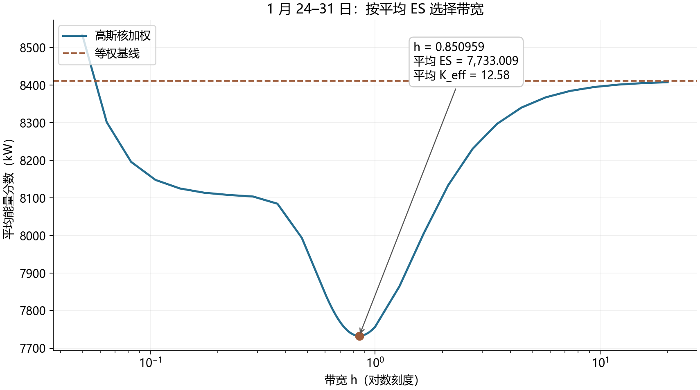
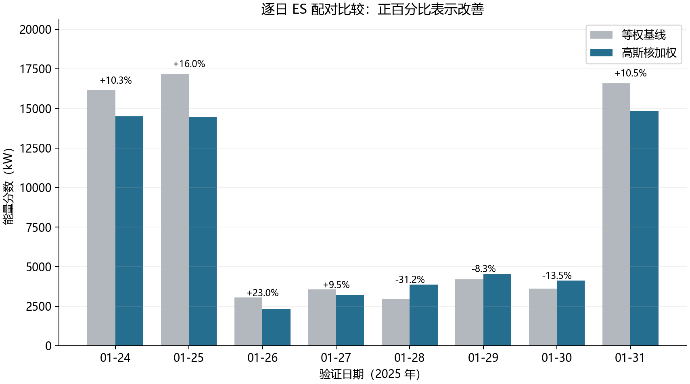

# 一月相似日核赋权：实验结论

**采纳高斯核加权。** 固定一月验证窗的平均 ES：等权 **8411.467322 kW**，高斯核 **7733.008565 kW**，改善 **8.0659%**，超过预先规定的 **3%** 采纳门槛。

## 冻结规则

- **参考池**：1 月 4–23 日，固定 20 个完整日。1–3 日用于三日滞后预热。验证日为 1 月 24–31 日，不扩充候选池，不更新标准化参数。两方法共用同一完整池，不额外随机抽样。
- **特征**：月份圆周位置（sin/cos 为同一个季节特征的两维编码）; 前三个完整日的负载日总电量均值（kWh）。共 2 个语义特征、3 个数值坐标。
- **标尺**：连续特征采用参考池处境的均值、总体标准差；季节圆周编码采用自然尺度。具体数值与精确 h 见 [frozen_rule.json](frozen_rule.json)。
- **高斯核**：$\pi_{d,\omega}\propto\exp[-\|z_d-z_\omega\|^2/(2h^2)]$，选定 **h=0.8509591316**，随后冻结。所有处境仅用各日 0:00 可知信息。
- **有效情景数**：最优核 $K_{\mathrm{eff}}$ 均值 **12.5806**，范围 **[9.7961, 15.6671]**；等权为 20。

## 特征消融与带宽

所有消融预先固定 h=1，按下表顺序逐个加入。平均 ES 改善须 **>0.5%** 且至少 **5/8 日**改善，最多四个特征。

| 候选 | 加入前平均 ES | 加入后平均 ES | 改善 | 改善日数 | 判定 |
|---|---:|---:|---:|---:|---|
| weekend | 8411.467 | 8662.727 | -2.987% | 5/8 | 不纳入 |
| pv_mean_3d | 8411.467 | 10023.654 | -19.167% | 3/8 | 不纳入 |
| recency | 8411.467 | 9123.139 | -8.461% | 5/8 | 不纳入 |
| pv_lag_1d | 8411.467 | 9569.265 | -13.765% | 5/8 | 不纳入 |
| pv_std_3d | 8411.467 | 10329.619 | -22.804% | 4/8 | 不纳入 |
| pv_trend_3d | 8411.467 | 8855.626 | -5.280% | 4/8 | 不纳入 |
| load_mean_3d | 8411.467 | 7756.599 | +7.785% | 5/8 | 纳入 |

条件删除检查：load_mean_3d：加入相对均值改善 +7.785%，5/8 日改善。逐日消融见 [feature_ablation_daily.csv](feature_ablation_daily.csv)。

**季节特征是先验例外**：一月月份编码均为 (0,1)，消融改善为 0%，未通过季内有效性验证；按任务要求保留。全年月度统计依据另行提供，本次没有使用全年观测来确定其编码或尺度。

带宽从 [0.05,20] 的 25 点对数粗网格开始，再做三轮各 17 点细搜，并比较等权极限；共 77 次评估、69 个不同 h。本次状态为 `interior_optimum`。只有平均 ES 参与选择，K_eff 不参与调参。

## 逐日配对结果

ES 对 **144 维完整净负荷功率曲线（负载减光伏，kW）**计算欧氏距离，完整保留 $-\frac12\sum\sum\pi\pi'\|x-x'\|$ 项，不截断负净负荷，不对评分坐标再标准化。

| 验证日 | 等权 ES | 核 ES | 改善 | 核 K_eff |
|---|---:|---:|---:|---:|
| 2025-01-24 | 16156.629 | 14496.150 | +10.277% | 12.34 |
| 2025-01-25 | 17179.303 | 14434.822 | +15.976% | 15.67 |
| 2025-01-26 | 3050.960 | 2349.251 | +23.000% | 9.80 |
| 2025-01-27 | 3555.961 | 3216.817 | +9.537% | 9.80 |
| 2025-01-28 | 2947.597 | 3867.466 | -31.207% | 15.63 |
| 2025-01-29 | 4188.204 | 4536.906 | -8.326% | 12.39 |
| 2025-01-30 | 3623.551 | 4114.418 | -13.547% | 12.54 |
| 2025-01-31 | 16589.534 | 14848.239 | +10.496% | 12.48 |
| **平均** | **8411.467** | **7733.009** | **+8.066%** | **12.58** |

总改善按两个平均 ES 计算；核在 **5/8 日**改善，所有变差日照实保留。核加权超过预先规定的 3% 门槛，因此在本任务范围内采纳。

## 验证与适用边界

8/8 日通过权重归一化、历史日期约束和未来扰动检查。对每个 d，打乱并扰动当天及之后的原始数据，重建特征、标准化参数与权重；77 种特征/带宽组合全部逐元素不变。ES 使用另外保存的原始真值评分，也完全不变。**替换评分真值或重新用被打乱的验证标签调参，本来就可能改变结果**；该检查证明的是给定规则的预测输入无前视泄漏。

**这八天同时用于选特征、选 h 和比较，结果属于调参窗口内表现，不是独立样本外证据。** 最终规则最早在 2 月 1 日可用。季节跨月效果及未来换池表现未经本实验检验；失败特征不等于在其他 h 或其他月份必定无效。

执行 `python TYA_Q2/solving/task4kernel/validate.py --verify-reproducibility` 可从附件一键重建数值表、参数和两张图；依赖见代码目录 `requirements.txt`。空目录独立进程复跑记录见 [reproducibility.json](reproducibility.json)，新建隔离环境验证见 [clean_environment.json](clean_environment.json)。[protocol.md](protocol.md) 给出完整协议、ES 定义及主模型接口用法。
