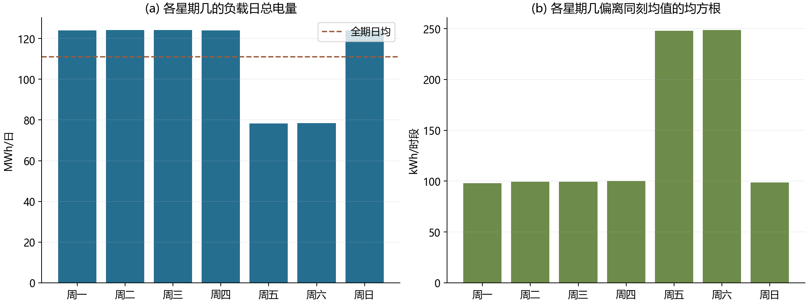
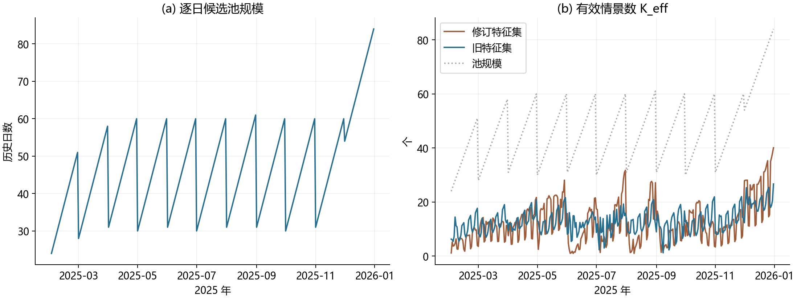
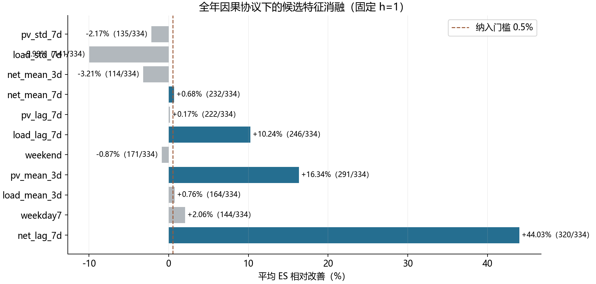
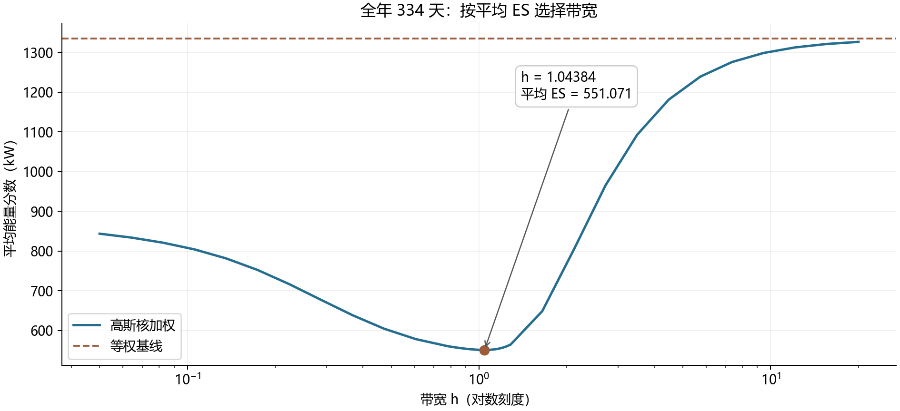
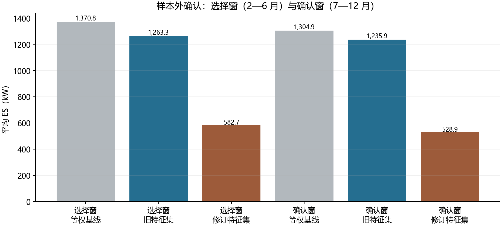

# 问题二全年特征探索与核赋权修订

**判定：采纳修订特征集。** 全年 334 天因果滚动协议下，
等权基线平均 ES 为 **1334.486 kW**，旧（一月版）特征集为 **1248.040 kW**，
修订特征集为 **551.071 kW**；修订相对等权改善 **+58.705%**
（预设门槛 3.0%），相对旧特征集改善 **+55.845%**。
修订方案超过预设门槛，据此改写研究日志的赋权规则章节。

## 一、全年结构证据

**周同期结构最强，且只有全年尺度才能识别。** 去除同刻全年均值后，负载在滞后 7 天处的
同刻相关系数为 **0.9722**、14 天处 **0.9600**，
而滞后 2—5 天只有 **-0.2141 至 -0.2142**。
日总电量尺度更明显：负载滞后 7 天自相关 **0.9880**、
净负荷 **0.9730**、光伏 **0.9294**；
滞后 14 天仍有 **0.9469**。一月窗口只覆盖一个完整周周期、
八天验证窗更没有第二个，因此这一结构必然被漏掉。

**星期几是第二个独立结构，且真实形态与一月假设不同。** 负载的星期几效应可解释去均值后
方差的 **85.28%**。
低负载并不落在周六与周日，而是落在 **周五、周六**：这两天的负载日总电量约
**78.3—78.4 MWh**，
其余五天约 **123.9—124.1 MWh**，
两者相差约 1.58 倍。
这解释了一月版 `weekend`（周六/日）标志为何在全年协议下反而使平均 ES 变差：
它把高负载的周日错划进了"周末"。

**简单预测基线复现文档结论。** 在 334 天评价区间上，组合基线（负载取上周同刻、
光伏取过去 7 日同刻均值）的净负荷 MAE 为
**45.56 kWh/时段**、WAPE
**9.11%**，与
`数据探索与问题2建模前分析.pdf` 表 1 的 45.56 与 9.11% 一致，说明本次读取口径与文档相同。

**"上周同日"就藏在候选池里。** 验证期每天的池规模在
**24—84** 天之间（中位
46 天）。334/334
天的池中含"上周同日"；若按净负荷日总电量距离排序，上周同日的中位排名为第
**6** 位，**36.2%**
的日子排进池内前 10%。核赋权要做的，正是把它从池里识别出来。

## 二、因果滚动协议

- **验证日**：2025-02-01 至 2025-12-31，共 334 天。
- **候选池**：$\mathcal{H}_d=\{j<d:\ j\ \text{与}\ d\ \text{的月份环形距离}\le 1,\ j\ge\text{2025-01-08}\}$，
  即决策日所在月及前后各一月内已完整结束的历史日；01-01 至 01-07 作为 7 日滞后特征预热，
  不作情景。池规则不含特征集合，因此等权与核加权共用同一池。
- **标尺**：连续特征用当日池处境的均值与总体标准差，日历编码取自然尺度；随池滚动，
  但只用 $j<d$ 的数据，不构成前视。
- **评分**：144 维净负荷功率曲线的完整能量分数，含 $-\tfrac12\sum\sum\pi\pi'\|x-x'\|$ 项，
  不截断负净负荷、不按时段标准化；真值只用于评分，不进入任何权重。

## 三、特征消融

候选顺序在读取消融结果前固定为：net_lag_7d, weekday7, load_mean_3d, pv_mean_3d, weekend, load_lag_7d, pv_lag_7d, net_mean_7d, net_mean_3d, load_std_7d, pv_std_7d。
`season` 作为日历结构先验置于最前，是一月窗口无法识别的结构性例外，不占四个名额。
消融固定 **h=1**，纳入条件为平均 ES 改善 **> 0.5%**
且至少 **60%** 的验证日严格改善。

| 依序候选 | 加入前平均 ES | 加入后平均 ES | 相对改善 | 改善日数 | 判定 |
|---|---:|---:|---:|---:|---|
| net_lag_7d | 1324.825 | 741.507 | +44.030% | 320/334 | 纳入 |
| weekday7 | 741.507 | 726.260 | +2.056% | 144/334 | 不纳入 |
| load_mean_3d | 741.507 | 735.862 | +0.761% | 164/334 | 不纳入 |
| pv_mean_3d | 741.507 | 620.378 | +16.336% | 291/334 | 纳入 |
| weekend | 620.378 | 625.759 | -0.867% | 171/334 | 不纳入 |
| load_lag_7d | 620.378 | 556.874 | +10.236% | 246/334 | 纳入 |
| pv_lag_7d | 556.874 | 555.915 | +0.172% | 222/334 | 不纳入 |
| net_mean_7d | 556.874 | 553.097 | +0.678% | 232/334 | 纳入 |
| net_mean_3d | 553.097 | 570.830 | -3.206% | 114/334 | 不纳入 |
| load_std_7d | 553.097 | 608.354 | -9.990% | 141/334 | 不纳入 |
| pv_std_7d | 553.097 | 565.119 | -2.174% | 135/334 | 不纳入 |

最终保留：

- `season`：月份圆周位置（sin/cos 是同一个季节特征的两维编码，取自然尺度）。
- `net_lag_7d`：七个完整日前的净负荷日总电量（kWh），即上周同一星期几。
- `pv_mean_3d`：前三个完整日的光伏日总电量均值（kWh）。
- `load_lag_7d`：七个完整日前的负载日总电量（kWh）。
- `net_mean_7d`：前七个完整日的净负荷日总电量均值（kWh）。
- `low_load_day`：低负载日标志：按全年数据，低负载落在周五与周六（取自然尺度）。

其中前 4 个语义特征由上面预先固定顺序的消融逐次纳入，
`low_load_day` 来自下一节的事后补充检验。本次不重排候选追求更好的数字，
未通过的特征与其失败原因一并保留在 `feature_ablation.csv`。

### 三之补充：星期几编码的事后假设检验

结构探索发现低负载日落在周五与周六，而 `weekend` 只把周六、周日标为同质。
据此另提两个候选，用**完全相同**的判据复核：`low_load_day`（周五或周六）
与 `weekday7`（七维指示编码）。二者是在看到上述结构证据之后才提出的，属于**事后假设**，
因此基础集固定为**选择窗**选出的特征集合，并同时在确认窗上独立复核。

全年 334 天：

| 补充候选 | 加入前平均 ES | 加入后平均 ES | 相对改善 | 改善日数 | 判定 |
|---|---:|---:|---:|---:|---|
| low_load_day | 620.378 | 584.612 | +5.765% | 263/334 | 通过 |
| weekday7 | 584.612 | 577.189 | +1.270% | 156/334 | 不通过 |

确认窗（2025-07-01 至 2025-12-31，样本外）：

| 补充候选 | 加入前平均 ES | 加入后平均 ES | 相对改善 | 改善日数 | 判定 |
|---|---:|---:|---:|---:|---|
| low_load_day | 607.224 | 566.802 | +6.657% | 159/184 | 通过 |
| weekday7 | 566.802 | 559.450 | +1.297% | 92/184 | 不通过 |

两个窗口都通过的事后候选为 **low_load_day**。它的编码来自纯描述性的星期几结构证据（低负载日落在周五、周六，与 ES 无关），并在时间上独立的确认窗复现了同向改善，故并入最终冻结规则；方法上仍标注为**事后补充**，证据强度低于按预先固定顺序纳入的主消融特征。

## 四、带宽与有效情景数

修订特征集上重新搜索带宽：先在 [0.05, 20] 做 25 点对数粗搜，再做三轮各 17 点细搜，
同时记录等权极限；共 77 次候选评估。结果 **h=1.043841464**，状态 `interior_optimum`。
旧特征集在同一协议下独立搜索带宽得 **h=0.390601653**；两者带宽各自冻结，不交叉调参。
仅平均 ES 参与选优，$K_{\mathrm{eff}}$ 只作诊断。

修订特征的 $K_{\mathrm{eff}}$ 均值 **12.17**
（范围 1.01—40.08），
旧特征集 **12.98**
（范围 1.23—26.70），
池规模均值 **46.69**。周同期特征让权重更集中，
这是平均 ES 改善的主要来源，同时意味着情景覆盖变窄，因此另做决策层抽样回测兜底。

## 五、配对比较与样本外确认

全年 334 天：修订相对等权改善 **+58.705%**，改善日数
**328/334**；
相对旧特征集改善 **+55.845%**，改善日数
**318/334**。

为排除"同一窗口内选参与比较"的弱点，把验证期按时间一分为二：**选择窗**
2025-02-01 至 2025-06-30 用于选特征与带宽，**确认窗** 2025-07-01 至 2025-12-31
只用于评价。两窗的池、标尺与评分规则完全一致。

| 窗口 | 方法 | 天数 | 平均 ES（kW） | 相对等权 |
|---|---|---:|---:|---:|
| 选择窗 | 等权基线 | 150 | 1370.781 | +0.000% |
| 选择窗 | 旧特征集 | 150 | 1263.269 | +7.843% |
| 选择窗 | 修订特征集 | 150 | 582.713 | +57.490% |
| 确认窗 | 等权基线 | 184 | 1304.897 | +0.000% |
| 确认窗 | 旧特征集 | 184 | 1235.944 | +5.284% |
| 确认窗 | 修订特征集 | 184 | 528.936 | +59.465% |

确认窗上修订方案仍优于等权基线
（+59.465%），说明改善主要不是选择窗内的偶然。

## 六、局限与适用边界

- 特征候选顺序由结构证据预先固定，不做穷举搜索；固定顺序的逐步纳入存在路径依赖，
  本次不重排候选追求更好的数字，失败特征的结果一并保留在 `feature_ablation.csv`。
- 平均 ES 是概率预测评分，不是费用指标。权重集中会缩小情景覆盖、可能低估尾部风险，
  故另设定量决策层回测，并与 `validation_report.md` 的求解核验共同兜底。
- 月份环形距离把 12 月与 1 月视为同季，符合净负荷的冬季形态；周末只按周六、周日识别，
  不判断法定节假日与调休。
- 规则自 2025-02-01 起可用。全年观测只用于**设计层面**的结构发现与规则冻结，
  不进入任何单日的决策输入。
