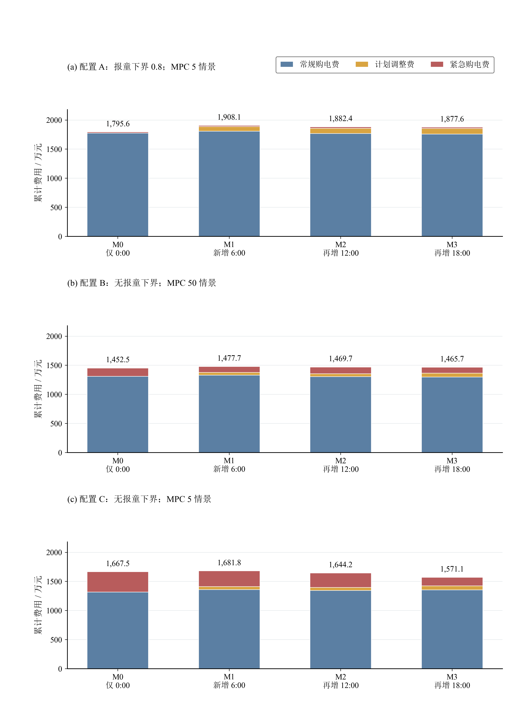
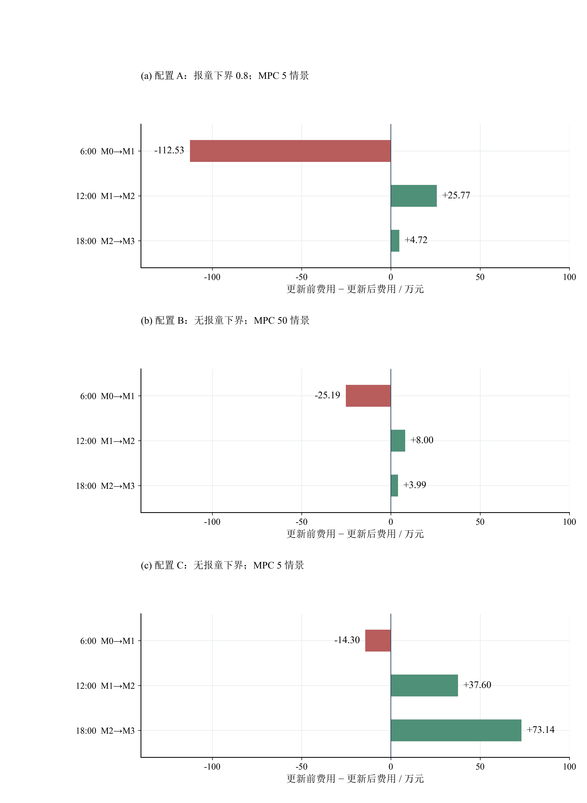
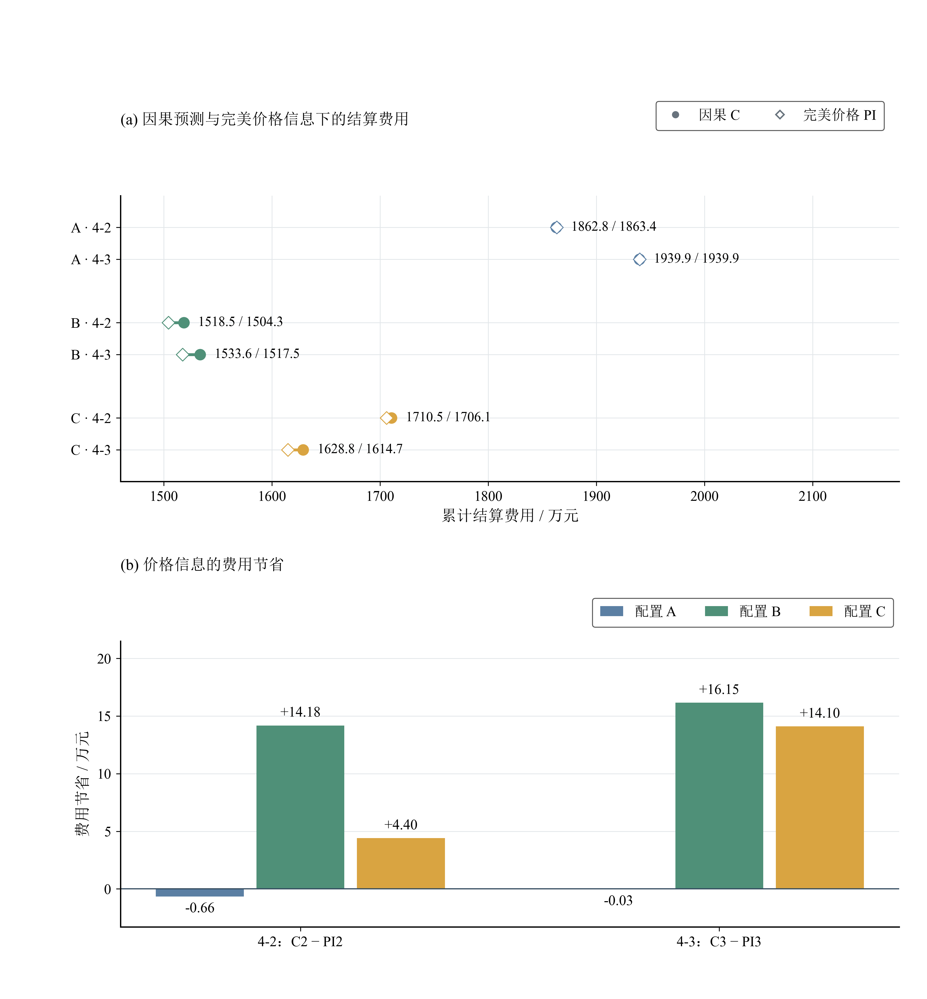
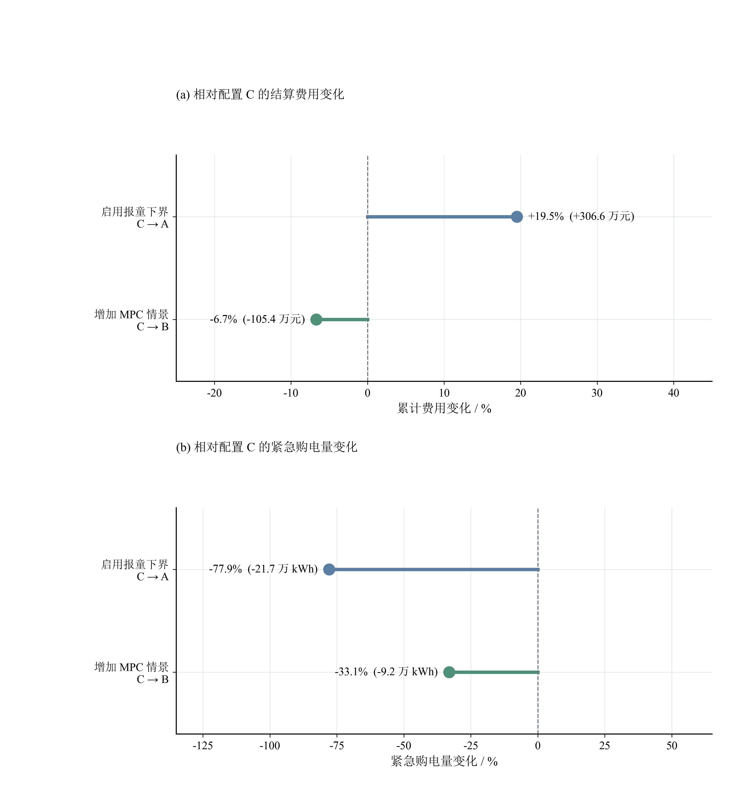
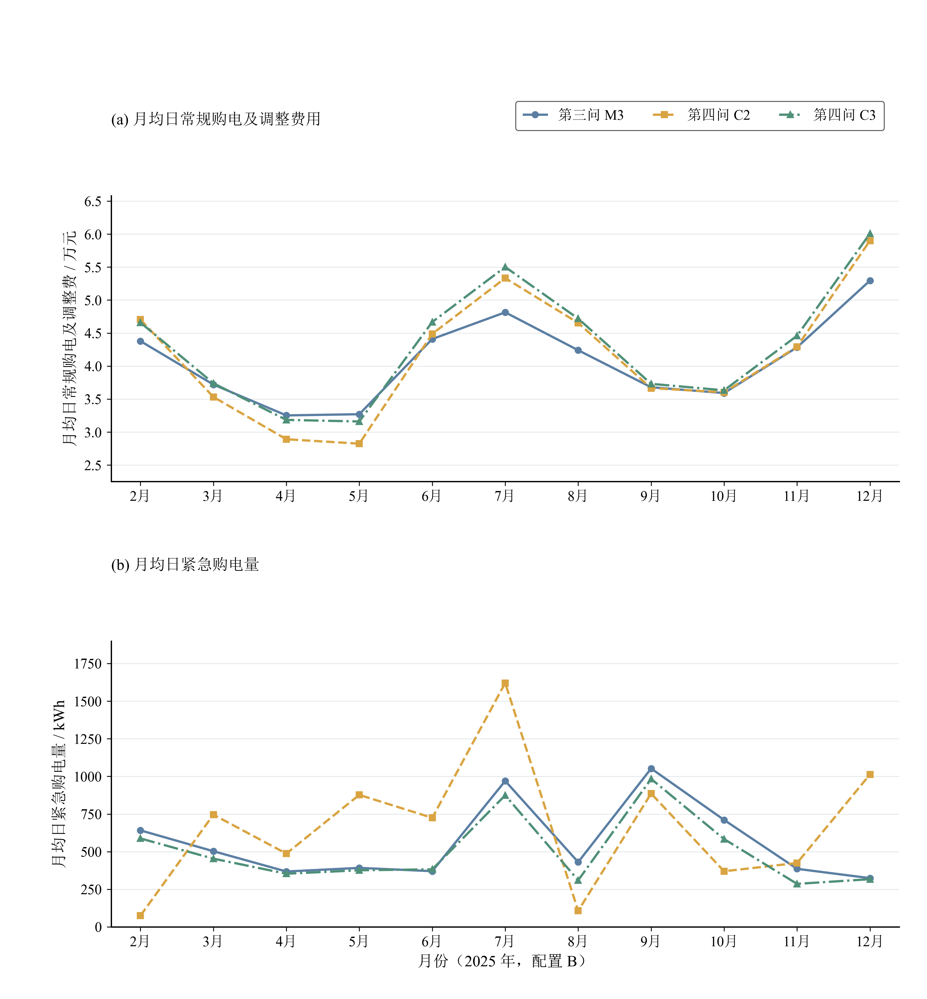
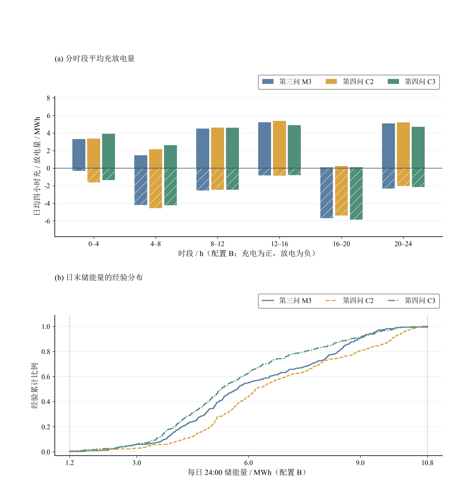
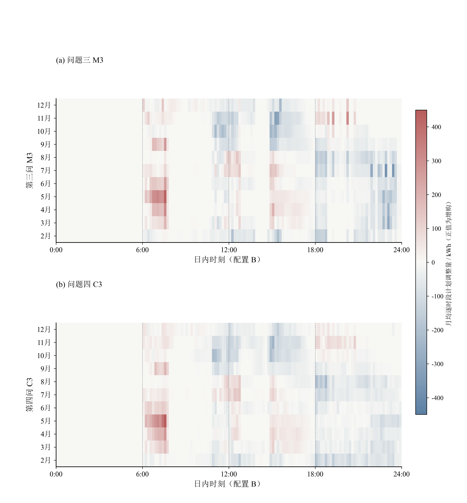
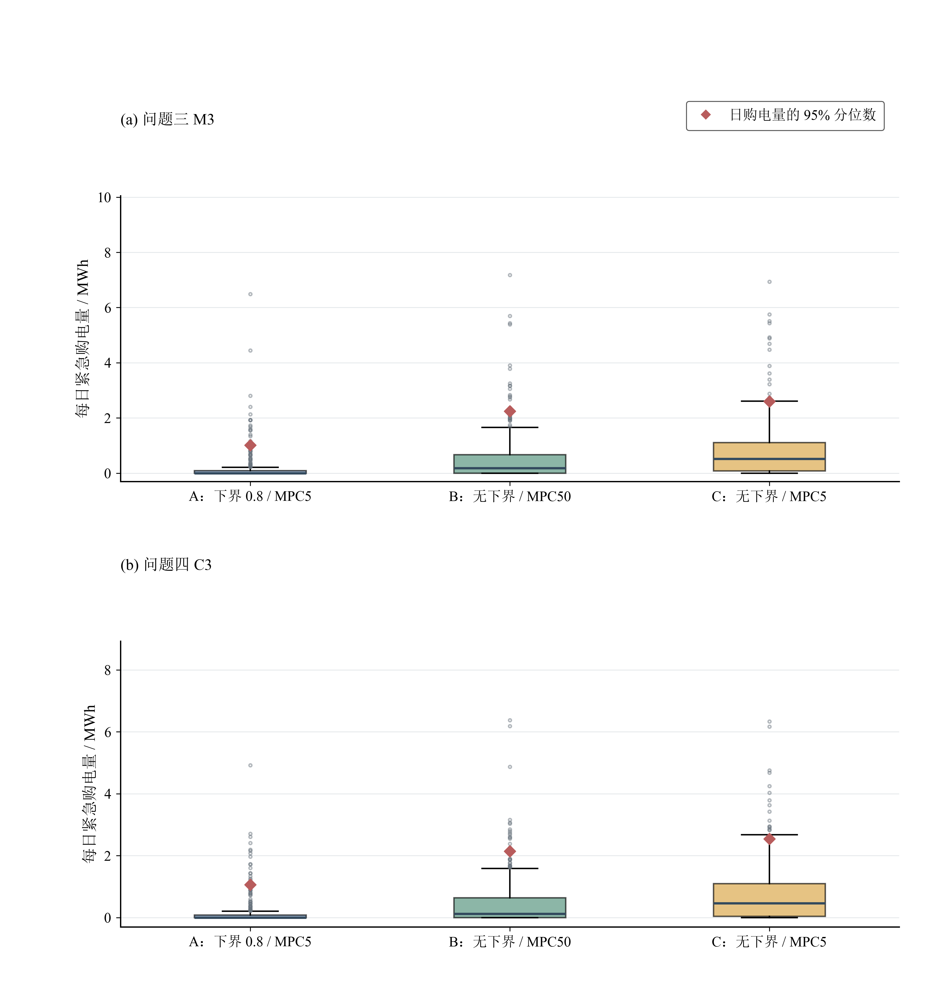

# 问题三、问题四结果图（含标题增强版）

8 张 400 DPI PNG（3600 像素宽）及 SVG 矢量文件。延续原 figure 配色、宋体与 Times 数字、白底细网格。
按用户要求加入主标题、子图编号、小标题、单位、图例和图下注释。未覆盖原图、原始输出、模型文档或求解代码。

统计期：2025-02-01 至 2025-12-31，共 334 天。A=下界0.8/MPC5；B=无下界/MPC50；C=无下界/MPC5。
问题三 M0/M1/M2/M3 依次允许 0 点、再加 6 点、再加 12 点、再加 18 点更新。问题四 C2/C3 为因果价格方案，PI2/PI3 为相应完美价格对照。

## 数据核对

6 份 JSON、9 份 Excel 均通过费用合计、日期和维度、紧急电量、日首末储能递推、跨日连续性及边界核对。详见 data/validation.json。
输入文件 SHA-256 在运行前后相同。所有图都通过缺字、字体最小值、文字出界和刻度重叠检查。
技能默认无标题的规则由本次用户明确要求覆盖，其他数据与版面检查保留。

## 使用边界

analysis.md 的消融实验只有文字汇总、缺少独立原始输出，未用来出图。其“45.4/6.0 约4.6倍”的说法也与算术不符，故未沿用。
不从日首末两点伪造十分钟 SOC；不从事件总电量推断逐时应急费用；不编造弃光率、统计显著性和置信区间。
购电 Excel 模板的时段标题偏移十分钟；按 export.py 列位置及 notation.md，将首列解释为 00:00—00:10，原文件不修改。
C→A / C→B 是已有配置的对照结果，不能据此证明所有参数情景下的普遍因果结论或 q 的最优值。

## 问题三：策略费用构成

柱顶为三项费用之和；全部柱从零起算，三个面板共用尺度。 结算费用不包含优化目标中的终端影子价值。

数据来源：6 份 JSON 中的 3 份 summary_problem3_*.json。

## 问题三：更新时刻的顺序边际收益

收益按 6:00→12:00→18:00 的指定顺序计算，不是独立消融或 Shapley 值。 图示为本次回测差额，现有数据不足以给出统计显著性或置信区间。

数据来源：summary_problem3_*.json；由相邻策略总费用作差。

## 问题四：价格信息价值

上图标注顺序为 C / PI；下图保留真实负值，不将差额截断为零。 A：下界 0.8、MPC5；B：无下界、MPC50；C：无下界、MPC5。

数据来源：summary_problem4_*.json；有限回测费用差，不等同于理论非负 EVPI。

## 问题三：配置单因素对照

C→A：MPC 均为 5，仅切换报童下界；C→B：均无下界，MPC 从 5 增至 50。 百分比均相对 C 计算；仅描述已保存回测，不外推最优参数或普遍因果结论。

数据来源：summary_problem3_*.json 的 M3 记录。

## 月度运行｜购电费用与紧急购电需求

每月按实际输出天数取日均，包含无紧急购电的日期。 上图不含紧急购电费，不能解释为每日总费用。

数据来源：result3 / result4-2 / result4-3_nofloor_mpc50.xlsx。

## 储能运行｜日内充放电与隔夜储能

正柱为充电、负柱为放电；同一四小时区间含两者不表示同时充放电。 下图每条曲线包含 334 个日末观测；两条竖虚线为 1.2 / 10.8 MWh 安全边界。

数据来源：result3 / result4-2 / result4-3_nofloor_mpc50.xlsx。

## 计划调整｜月均日内增购与减购分布

调整量 = 最终生效计划 − 0:00 原计划；红色增购、蓝色减购。 共享对称色标，完整覆盖数据；竖线标记 6:00、12:00、18:00 更新时刻。

数据来源：result3 / result4-2 / result4-3_nofloor_mpc50.xlsx。

## 紧急购电：每日分布

箱体为第 25%—75% 分位数，中线为中位数，须线按 1.5 倍四分位距绘制。 圆点保留须线外观测；红菱形为 P95 分位数，不是置信区间或供电中断概率。

数据来源：6 份 result3 / result4-3 工作簿的紧急购电量工作表。

## 复现

`python figure_q34_build.py --myh .. --out .`

依赖现有 ../figure/plot_results.py 及其 utils/plot_style.py；使用 Python 3.12，matplotlib、numpy、openpyxl、Pillow。
data/ 保存逐日、逐月、费用、更新收益和分布指标 CSV，可直接核对。

## 本次版式修改

坐标轴、刻度、轴名与色标均为黑色。上下子图间留出 1.55 英寸；子标题距主体 0.66 英寸。图例为绘图区外白底细框。

body/ 为不含后期标注的纯主体 PNG/SVG；annotations/ 为独立 JSON 和透明标注层；vector/ 的 SVG 包含 editable_annotations 可编辑文本层。

后续只改 annotations/*.json 的文字或 x/y 坐标，再运行 `python compose_annotations.py`，即可重新排版，不必运行数据绘图。重新完整绘图会重建标注初始布局，修改后请保留 JSON 备份。

## 当前论文样式（最新）

主标题改为 13pt 常规宋体，居中；子标题 11pt 常规字重。英文与数字使用 Times New Roman，标注文字统一黑色。图内日期副标题、装饰分隔符和长说明已删除，数据口径留在本说明文件。黑色坐标、框式图例和子图留白保留。

现有 figure 目录已不存在，完整数据重绘脚本的旧依赖不可用。当前版式修订由 revise_paper_artifacts.py 基于保留的主体图与独立标注完成；日常仅修改 annotations/*.json 并运行 compose_annotations.py，无需依赖原 figure 目录。_layout_source 保留本次修订前的主体与标注，可用于复现。

## 当前论文样式（最新）

主标题改为 13pt 常规宋体，居中；子标题 11pt 常规字重。英文与数字使用 Times New Roman，标注文字统一黑色。图内日期副标题、装饰分隔符和长说明已删除，数据口径留在本说明文件。黑色坐标、框式图例和子图留白保留。

现有 figure 目录已不存在，完整数据重绘脚本的旧依赖不可用。当前版式修订由 revise_paper_artifacts.py 基于保留的主体图与独立标注完成；日常仅修改 annotations/*.json 并运行 compose_annotations.py，无需依赖原 figure 目录。_layout_source 保留本次修订前的主体与标注，可用于复现。

最终调整：全部 8 张图已去掉主标题，保留子标题、数据标注、坐标轴与图例。PNG、SVG、独立标注层和总览同步更新。
