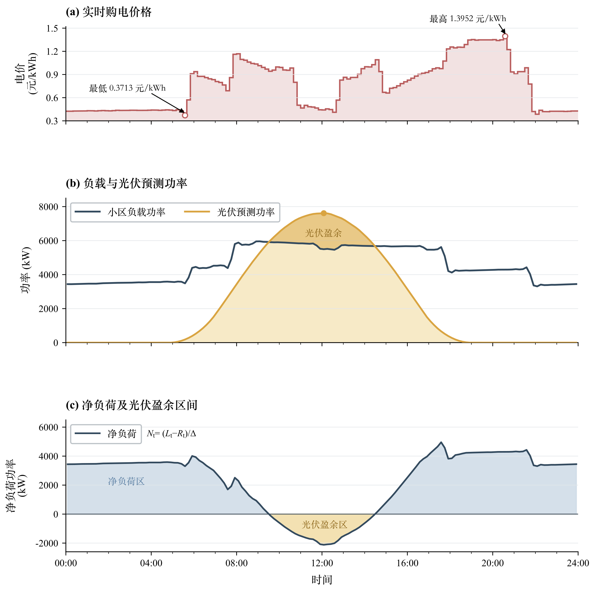
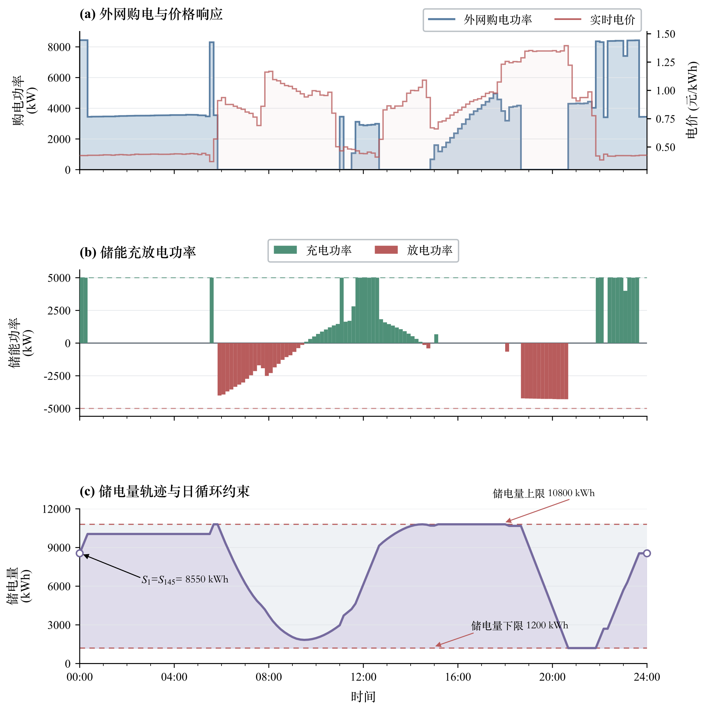
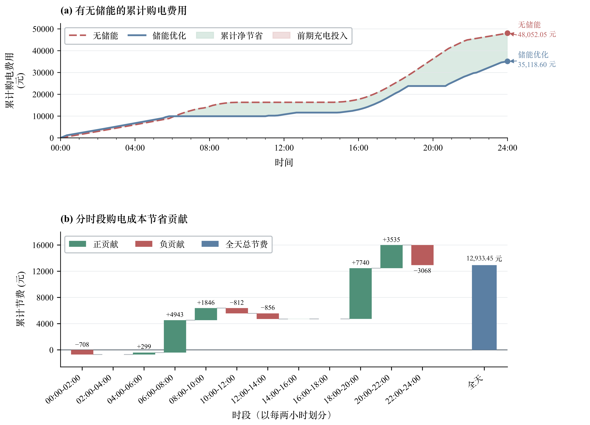
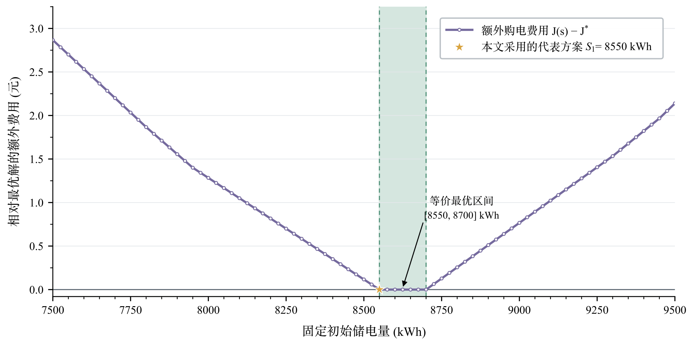

# 问题一：典型日微网购电与储能联合调度

## 1 问题重述

某非孤岛式微网由小区负载、光伏发电系统、储能设备和外部电网构成。附件 1 给出了一个典型日内每隔 10 min 的外网购电价格、小区负载功率和光伏预测功率。微网可利用光伏直接供电，也可在低电价或光伏富余时为储能充电，并在电价较高时放电；若本地电源不能满足负载，则从外网购电。

问题一要求在每日 0:00 制定未来 24 h 的计划购电策略，使各时段供电量均不低于小区负载，并满足储能容量、最大充放电功率、充放电效率及日初日末储电量相同等约束。在此基础上，需要确定各 10 min 时段的外网购电量和储能充放电量，使全天购电费用最小，并按指定格式汇总结果。

## 2 问题分析

问题一中，全天电价、负载和光伏预测数据均已给定，决策不会受到随机扰动，因而属于**确定性日前调度问题**。其决策具有明显的时间耦合性：某时段充电会增加后续可用电量，某时段放电则会消耗后续储能余量，故不能逐时段独立地选择最低费用方案，而应在全天范围内联合优化。

附件 1 中负载和光伏以功率（kW）给出，而购电、充放电及储电量以电量（kWh）计量。为统一能量平衡口径，将功率乘以时段长度 \(\Delta=1/6\ \mathrm h\)，换算为各时段电量。进一步定义仅用于数据解释的净负荷功率

$$
N_t=\frac{L_t-R_t}{\Delta},
$$

其中 \(N_t>0\) 表示光伏不足，\(N_t<0\) 表示存在光伏富余。由图 1 可知，全天电价在 \(0.3713\sim1.3952\ \mathrm{元/kWh}\) 之间显著波动；光伏预测功率在 12:00 左右达到峰值，并在 09:30--14:30 超过负载。由此，储能同时具有两类经济作用：一是吸收午间富余光伏以减少弃光，二是在低价时段储电、在高价时段放电以实现跨时段能量转移。

附件 1 所给数据并非某一任意单日。将其逐列与附件 2（2025 年 365 天逐 10 min 实际值）的全年同一时刻均值比较，负载的最大绝对差仅为 \(5\times10^{-5}\ \mathrm{kW}\)，光伏的最大绝对差仅为 \(0.043\ \mathrm{kW}\)，均在四舍五入精度内。因此，附件 1 是**全年平均意义下的确定性典型日**：它抹平了日际波动，只保留负载与光伏的典型日形状。问题一据此建立的是全年平均基准下的调度策略，而后续问题在此基础上逐步恢复日际波动与预测误差。

*图 1 典型日输入数据及净负荷特征*

外网购电费用是各时段购电量的线性函数，能量平衡、储能状态递推和设备边界也均可表示为线性等式或不等式。因此，在不引入充放电互斥二元变量的情况下，该问题可建立为线性规划模型。考虑到正电价、储能损耗和弃光变量已能处理富余光伏，同时充放电不具备直接经济收益，本文先求解线性松弛模型，再对所得调度逐时段检查充放电互斥性；若出现非物理解，再将模型扩展为混合整数线性规划。

综上，本文按“数据换算与特征分析—线性规划建模—模型求解—结果分析”的主线展开：首先统一功率与电量的计量口径，结合图 1 剖析典型日数据特征并明确储能的经济作用（§2）；其次建立以全天购电费用最小为目标的线性规划模型，并给出充放电互斥的处理策略（§4、§5）；然后调用 HiGHS 求解器求解，并分析最优初始储电量区间（§6）；最后从运行规律、经济收益和初始储电量敏感性三个层面分析结果，并对模型有效性作内嵌检验（§7）。技术路线流程图将在论文排版阶段补充。

## 3 模型假设

1. 附件 1 中的电价、负载功率和光伏预测功率在计划制定时均准确已知，且每个 10 min 时段内保持为表中给定值。
2. 微网不向外网售电，外网能够满足任意剩余用电缺口；外网购电量非负，且不另设购电功率上限。
3. 光伏优先在微网内部消纳，无法被负载或储能利用的光伏允许弃置，且弃光不产生额外费用。
4. 题目给出的“充放电效率为 90%”解释为充电效率和放电效率均为 \(0.9\)；除充放电损耗外，忽略储能自放电、寿命衰减和运维费用。
5. 附录给出的 \(6000\ \mathrm{kWh}\) 是 2025 年 1 月 1 日 0:00 的已知状态，而附件 1 的典型日未指定为该日期，故问题一不将 \(6000\ \mathrm{kWh}\) 固定为日初储电量。日初储电量由模型优化决定，并严格满足题目要求的日循环约束。
6. 调度量可在允许范围内连续取值，不考虑功率调节的最小步长和启停时间。

## 4 符号说明

一天划分为 144 个等长时段，令 \(\mathcal T=\{1,2,\ldots,144\}\)，时段 \(t\) 对应区间 \([(t-1)\Delta,t\Delta]\)。主要符号见表 1。

**表 1 主要符号及含义**

| 符号 | 含义 | 单位或取值 |
|---|---|---|
| \(t,\mathcal T\) | 时段指标及其集合 | \(t\in\mathcal T\) |
| \(\Delta\) | 单个时段长度 | \(1/6\ \mathrm h\) |
| \(P_t\) | 时段 \(t\) 的外网购电价格 | 元/kWh |
| \(\ell_t\) | 时段 \(t\) 的小区负载功率 | kW |
| \(P_t^{\mathrm{PV}}\) | 时段 \(t\) 的光伏预测功率 | kW |
| \(L_t\) | 时段 \(t\) 的负载电量，\(L_t=\ell_t\Delta\) | kWh |
| \(R_t\) | 时段 \(t\) 的可用光伏电量，\(R_t=P_t^{\mathrm{PV}}\Delta\) | kWh |
| \(N_t\) | 时段 \(t\) 的净负荷功率 | kW |
| \(G_t\) | 时段 \(t\) 的外网购电量 | kWh |
| \(C_t,D_t\) | 时段 \(t\) 交流母线侧的充电量、放电量 | kWh |
| \(W_t\) | 时段 \(t\) 的弃光量 | kWh |
| \(S_t\) | 时段 \(t\) 开始时的储电量 | kWh |
| \(S^{\min},S^{\max}\) | 储电量下限、上限 | \(1200,10800\ \mathrm{kWh}\) |
| \(\bar e\) | 单时段最大充电量或放电量 | \(5000\Delta=833.33\ \mathrm{kWh}\) |
| \(\eta\) | 单向充电效率和放电效率 | \(0.9\) |
| \(J\) | 全天外网购电费用 | 元 |

其中，\(S_1\) 表示 0:00 的储电量，\(S_{145}\) 表示 24:00 的储电量；\(G_t,C_t,D_t,W_t\) 和 \(S_t\) 均为决策变量，其余为已知参数或派生量。

## 5 模型建立

在逐项给出模型之前，先说明模型形式的选择依据。由 §2 的分析可知，购电费用、时段能量平衡、储能状态递推和设备边界均为线性关系，问题具有天然的线性结构。线性规划能够保证全局最优性，无须调节算法参数，且对本题规模可稳定快速求解，因此优先于动态规划与启发式算法，成为首选的建模框架。唯一的非线性因素——充放电互斥——需以 144 个二元变量为代价，本文按“先线性松弛、后物理检验”的策略处理，具体见 §5.5。

### 5.1 目标函数

微网在时段 \(t\) 的购电费用为 \(P_tG_t\)。问题一只要求最小化购电费用，故全天目标函数为

$$
\min J=\sum_{t=1}^{144}P_tG_t.
$$

该目标会在满足供电和设备约束的前提下，自动权衡低价购电、光伏消纳与高价时段放电之间的关系。

### 5.2 时段能量平衡

对任意 \(t\in\mathcal T\)，外网购电、光伏发电和储能放电共同构成能量供给，负载、储能充电和弃光构成能量去向，因此有

$$
G_t+R_t+D_t=L_t+C_t+W_t,\qquad \forall t\in\mathcal T.
$$

该式保证每一时段供需严格平衡，因而必然满足“微网提供的电能不可低于小区负载”的要求。变量 \(W_t\) 用于吸收不能被负载或储能利用的光伏电量，并满足

$$
0\le W_t\le R_t.
$$

### 5.3 储能状态递推

本文将 \(C_t\) 和 \(D_t\) 均定义在交流母线侧。充入母线侧电量 \(C_t\) 后，仅有 \(\eta C_t\) 存入储能；为向母线输出 \(D_t\)，储能内部需减少 \(D_t/\eta\)。因此储电量递推关系为

$$
S_{t+1}=S_t+\eta C_t-\frac{D_t}{\eta},\qquad \forall t\in\mathcal T.
$$

储能在运行过程中不得过充或过放，且充放电量不得超过最大功率在一个时段内对应的电量，故

$$
S^{\min}\le S_t\le S^{\max},\qquad t=1,2,\ldots,145,
$$

$$
0\le C_t\le\bar e,\qquad 0\le D_t\le\bar e,\qquad \forall t\in\mathcal T.
$$

### 5.4 日循环与变量范围

为防止模型通过在日末无偿消耗初始库存来虚假降低购电费，按题意设置

$$
S_{145}=S_1.
$$

该约束意味着全天储能净变化为零。结合状态递推式可得

$$
\sum_{t=1}^{144}D_t=\eta^2\sum_{t=1}^{144}C_t,
$$

即全天放电量等于全天充电量扣除往返损耗后的可用电量。此外，外网购电量满足

$$
G_t\ge0,\qquad \forall t\in\mathcal T.
$$

综上，问题一的完整模型为

$$
\begin{aligned}
\min\quad &J=\sum_{t=1}^{144}P_tG_t,\\
\mathrm{s.t.}\quad
&G_t+R_t+D_t=L_t+C_t+W_t, &&\forall t\in\mathcal T,\\
&S_{t+1}=S_t+\eta C_t-\frac{D_t}{\eta}, &&\forall t\in\mathcal T,\\
&S^{\min}\le S_t\le S^{\max}, &&t=1,\ldots,145,\\
&0\le C_t,D_t\le\bar e, &&\forall t\in\mathcal T,\\
&0\le W_t\le R_t,\quad G_t\ge0, &&\forall t\in\mathcal T,\\
&S_{145}=S_1.
\end{aligned}
$$

### 5.5 充放电互斥的处理

若直接加入二元变量限制 \(C_tD_t=0\)，模型将由线性规划变为混合整数线性规划。由于本题各时段电价均为正、充放电存在损耗，且多余光伏可通过 \(W_t\) 弃置，同时充放电不会带来额外售电收益，其经济意义仅相当于无效的内部能量循环。因此本文不预先增加 144 个二元变量，而采用“线性松弛求解加逐时段物理检查”的处理方式。

需要指出的是，上述经济性判断并不等价于宣称线性规划的每一个退化最优解都必然互斥。因此，本文把

$$
C_tD_t=0,\qquad \forall t\in\mathcal T
$$

作为解的物理有效性检验条件：若求解器返回同时充放电时段，则加入二元变量重新求解；若全部时段均满足互斥，则当前 LP 解同时具备最优性与物理可解释性。实际结果中 144 个时段均通过该检验，故无须将模型扩展为混合整数规划。

## 6 模型求解

将决策变量按

$$
\boldsymbol{x}=(G_1,\ldots,G_{144},C_1,\ldots,C_{144},D_1,\ldots,D_{144},W_1,\ldots,W_{144},S_1,\ldots,S_{145})^{\mathsf T}
$$

排列，可将模型写为标准线性规划形式

$$
\min\ \boldsymbol{c}^{\mathsf T}\boldsymbol{x},\qquad
\mathrm{s.t.}\ \boldsymbol{A}_{\mathrm{eq}}\boldsymbol{x}=\boldsymbol{b}_{\mathrm{eq}},\quad
\boldsymbol{l}\le\boldsymbol{x}\le\boldsymbol{u}.
$$

模型共含 721 个连续变量和 289 个等式约束。本文采用 Python 的 SciPy 线性规划接口调用 HiGHS 求解器。HiGHS 是当前综合性能领先的开源线性规划求解器，集成原始单纯形法、对偶单纯形法与内点法，对本题规模可稳定求得全局最优解；本文将原始可行性与对偶可行性容差均设为 \(10^{-8}\)，使约束残差比后续检验所用的 \(10^{-6}\) 校验容差低两个数量级以上，保证结果可独立复核。求解器经过 375 次迭代后返回最优状态，得到最小购电费用

$$
J^*=35118.60\ \mathrm{元}.
$$

由于主问题未固定 \(S_1\)，还需判断所得初始储电量是否唯一。为此，在保留原模型全部约束并固定未舍入最优费用 \(J=J^*\) 的条件下，分别求解

$$
\min S_1\qquad\text{和}\qquad\max S_1.
$$

两次辅助线性规划给出最优初始储电量区间

$$
S_1\in[8550,8700]\ \mathrm{kWh}.
$$

该区间是原线性规划最优解集在 \(S_1\) 维度上的投影，不是统计意义上的置信区间。由于线性规划的最优可行域为凸集，区间内任一 \(S_1\) 均存在至少一组调度使购电费用保持为 \(J^*\)。不同初始储电量对应的储电轨迹必然不同，购电与充放电策略也可能重新分配，但目标值相同。为统一结果表和后续分析，本文选取区间下端点 \(S_1=8550\ \mathrm{kWh}\) 对应的主解作为代表性最优方案。

此外，为分析初始储电量偏离最优区间后的费用变化，固定

$$
S_1=S_{145}=s
$$

并在每个给定的 \(s\) 下重新求解原模型，记所得最优费用为 \(J(s)\)，以 \(J(s)-J^*\) 衡量额外购电费用。局部分析在 \([7500,9500]\ \mathrm{kWh}\) 内按 25 kWh 扫描；全范围 \([1200,10800]\ \mathrm{kWh}\) 的粗扫描仅用于检验模型结构。

## 7 结果分析

### 7.1 最优购电与储能运行规律

图 2 展示了代表性最优方案的外网购电、储能充放电和储电量轨迹。由图 2(a) 可见，购电功率并非简单跟随负载变化，而会对电价作出跨时段响应：低价阶段可适当增加购电并储存，高价阶段则减少购电或由储能承担负荷缺口。

*图 2 最优购电与储能调度结果*

具体而言，0:00 后的低价时段先由外网补充储能，将购电行为前移至低价窗口；05:50 起电价进入早高峰，储能于 05:50--09:30 连续放电，显著压减该阶段的购电支出。09:30--14:30 光伏功率高于负载，富余光伏全部用于充电，使储电量再次升至上限 \(10800\ \mathrm{kWh}\)，为晚间高峰储备能量。18:40--20:40 是全天电价最高的阶段，储能持续放电并于 20:40 降至下限 \(1200\ \mathrm{kWh}\)，以最大化高价时段替代购电的收益；22:00 前后电价回落后，外网再次为储能补能，使 24:00 储电量恢复至 \(8550\ \mathrm{kWh}\)，严格满足日循环约束。上述轨迹表明，线性规划解在无需互斥约束干预的情况下，自动呈现出“低价及光伏富余时充电、高价时放电”的跨时段套利规律。

从统计特征看，全天共有 **44 个充电时段、37 个放电时段和 63 个静置时段**，其中 **19 个时段以 \(5000\ \mathrm{kW}\) 上限功率充电**，最大放电功率为 \(4293.92\ \mathrm{kW}\)。储电量最低值和最高值分别为 \(1200\ \mathrm{kWh}\) 和 \(10800\ \mathrm{kWh}\)，恰好触及设备边界，说明储能可用容量被充分调用。全天充电量为 \(20740.67\ \mathrm{kWh}\)，放电量为 \(16799.94\ \mathrm{kWh}\)，两者精确满足 \(16799.94=0.9^2\times20740.67\)，对应储能往返损耗 \(3940.73\ \mathrm{kWh}\)。最优方案**弃光量为 0**，午间 \(6247.96\ \mathrm{kWh}\) 的光伏富余均被储能吸收。这表明在经济目标驱动下，储能同时实现了跨时段套利与光伏全额消纳，其双重价值得到充分发挥。

### 7.2 指定时段购电结果

代表性最优方案的指定时段购电量见表 2。全天共购电 \(59482.70\ \mathrm{kWh}\)，购电费用为 \(35118.60\ \mathrm{元}\)。

**表 2 指定时段购电量及全天结果**

| 时间段 | 购电量/kWh | 时间段 | 购电量/kWh | 时间段 | 购电量/kWh |
|---|---:|---|---:|---|---:|
| 10:00--10:10 | 0.00 | 12:00--12:10 | 480.41 | 14:00--14:10 | 0.00 |
| 16:00--16:10 | 445.43 | 18:00--18:10 | 531.89 | 20:00--20:10 | 0.00 |
| 全天购电量 | 59482.70 | 全天购电费 | 35118.60 |  |  |

### 7.3 分时段充放电结果

按题目要求将 144 个时段的充放电量每 4 h 汇总，结果见表 3。其中充电量和放电量均为交流母线侧电量，且以正数列示。

**表 3 分时段充放电量及日初日末储电量**

| 时间段 | 充电量/kWh | 放电量/kWh | 时间段 | 充电量/kWh | 放电量/kWh |
|---|---:|---:|---|---:|---:|
| 00:00--04:00 | 1666.67 | 0.00 | 04:00--08:00 | 833.33 | 6365.84 |
| 08:00--12:00 | 4787.96 | 1703.00 | 12:00--16:00 | 5286.04 | 91.10 |
| 16:00--20:00 | 0.00 | 5780.13 | 20:00--24:00 | 8166.67 | 2859.87 |
| 0:00 储电量 | 8550.00 |  | 24:00 储电量 | 8550.00 |  |

### 7.4 经济收益分析

为量化储能带来的经济收益，构造无储能基准方案：各时段仅用光伏满足负载，不足部分由外网购电，富余光伏直接弃置。此时

$$
G_t^{0}=\max\{L_t-R_t,0\},\qquad
J_0=\sum_{t=1}^{144}P_tG_t^{0}.
$$

有、无储能方案的费用对比见表 4 和图 3。

**表 4 储能优化的经济效果**

| 指标 | 无储能基准 | 储能优化 | 变化量 |
|---|---:|---:|---:|
| 全天购电量/kWh | 61789.94 | 59482.70 | -2307.24 |
| 全天弃光量/kWh | 6247.96 | 0.00 | -6247.96 |
| 全天购电费用/元 | 48052.05 | 35118.60 | -12933.45 |
| 购电费用节省率 | - | - | 26.92% |

*图 3 有无储能的购电费用及分时段节省贡献*

储能优化使购电费用由 \(J_0=48052.05\ \mathrm{元}\) 降至 \(J^*=35118.60\ \mathrm{元}\)，**共节省 \(12933.45\ \mathrm{元}\)，节省率达 \(26.92\%\)**：

$$
\frac{J_0-J^*}{J_0}\times100\%=26.92\%.
$$

图 3(a) 显示，储能方案在部分低价时段因提前购电充电而产生短期额外支出，但在后续高价时段通过放电形成更大幅度的累计节省。为解释各阶段对全天收益的贡献，将每 2 h 时段集合记为 \(\mathcal H\)，并计算

$$
\Delta J_{\mathcal H}=\sum_{t\in\mathcal H}P_t\left(G_t^{0}-G_t\right).
$$

当 \(\Delta J_{\mathcal H}>0\) 时，该时段对全天节费作正贡献；反之则表示为后续放电或恢复日末储电量而发生的充电投入。图 3(b) 表明，**18:00--22:00 的高价阶段是节费的主要来源**，而 22:00--24:00 为满足日循环约束进行补能，形成负贡献。各阶段贡献相加仍得到全天净节省 \(12933.45\ \mathrm{元}\)，说明终端补能成本已被完整计入，而非通过消耗初始电量夸大收益。该节省由电价跨时段套利与光伏全额消纳共同构成，且已扣除储能往返损耗，说明在典型日条件下配置储能具有显著的经济价值，也为后续考虑日际波动与预测误差的调度问题提供了费用基准。

### 7.5 初始储电量的非唯一性

图 4 给出了固定不同初始储电量后，相对全局最优值的额外购电费用。曲线在 \([8550,8700]\ \mathrm{kWh}\) 内形成**零增量平台**，验证了该区间内存在多组等价最优初始状态；离开该区间后，最优费用呈分段线性上升。本文标出的 \(S_1=8550\ \mathrm{kWh}\) 只是用于展示和填表的代表方案，并不意味着该点是唯一最优初始状态。

*图 4 初始储电量对最优购电费用的局部敏感性*

### 7.6 模型有效性说明

直接依据物理方程重算最优解的约束残差：逐时段能量平衡、储能状态递推、日循环、变量边界与全天能量账目的最大误差均不超过 \(7.3\times10^{-12}\ \mathrm{kWh}\)，远低于 \(10^{-6}\ \mathrm{kWh}\) 的校验容差，且目标函数重算误差为 0（六项指标的完整数据见附录 B）。求解器返回的原始与对偶目标值之差仅为 \(2.91\times10^{-11}\ \mathrm{元}\)，原始可行性与对偶最优性同时成立，说明 \(J^*\) 确为线性规划的全局最优值。逐时段互斥检查显示同时充放电时段数为 0，LP 解物理有效，无须扩展为混合整数规划。此外，针对初始储电量的 120 次固定状态重求解全部可行且互斥（见附录 C），全范围最大额外费用仅为 \(83.62\ \mathrm{元}\)，表明最优费用对 \(S_1\) 取值稳健。综上，模型与代表性调度方案通过了数值精度、全局最优性和物理有效性三个层面的检验。

## 附录

### 附录 A 充放电互斥性的理论说明

**命题** 对 §5 模型的任一可行解，必存在满足 \(C_tD_t=0\ (\forall t\in\mathcal T)\) 的可行解，其购电费用不高于原解；特别地，最优解集中必含互斥解。

**证明要点** 设某时段 \(t\) 有 \(C_t>0\) 且 \(D_t>0\)，取 \(\delta=\min\{C_t,\ D_t/\eta^2\}>0\)，令

$$
C_t'=C_t-\delta,\qquad D_t'=D_t-\eta^2\delta.
$$

则 \(\eta C_t'-D_t'/\eta=\eta C_t-D_t/\eta\)，储能状态轨迹完全不变，其余各时段均不受影响。此时能量平衡多出 \(\delta(1-\eta^2)>0\) 的盈余供给，可用两种方式吸收：

1. 若 \(G_t\ge\delta(1-\eta^2)\)，令 \(G_t'=G_t-\delta(1-\eta^2)\)，则购电费用严格减少 \(P_t\,\delta(1-\eta^2)>0\)（因 \(P_t>0\)）；
2. 若弃光尚有裕量（\(W_t<R_t\)），取充分小的 \(\delta\) 并令 \(W_t'=W_t+\delta(1-\eta^2)\)，费用保持不变。

调整后 \(C_t'\) 或 \(D_t'\) 归零。对所有时段重复该操作，即得费用不增的互斥解。情形 1 还表明：任何 \(G_t>0\) 的时段若同时充放电，解必可严格改进，故最优解中同时充放电只可能出现在无购电且光伏无可弃裕量的完全退化时段；本题实际最优解弃光量为 0，该退化情形不出现，数值结果（附录 B）亦证实 144 个时段全部互斥。

### 附录 B 主模型数值检验的完整数据

数据交叉核验：以“功率乘以 \(1/6\ \mathrm h\)”重算负载与光伏电量，与附件 1 电量列的最大差异均为 \(3.33\times10^{-7}\ \mathrm{kWh}\)，确认计量口径一致。

约束残差、最优性与物理有效性检验的完整结果见表 B1。

**表 B1 主模型数值检验结果**

| 检验指标 | 最大误差 | 结论 |
|---|---:|---|
| 逐时段能量平衡 | \(2.27\times10^{-13}\ \mathrm{kWh}\) | 通过 |
| 储电量状态递推 | \(8.31\times10^{-13}\ \mathrm{kWh}\) | 通过 |
| 日循环约束 | \(0\ \mathrm{kWh}\) | 通过 |
| 变量边界越界量 | \(0\ \mathrm{kWh}\) | 通过 |
| 全天能量账目 | \(7.28\times10^{-12}\ \mathrm{kWh}\) | 通过 |
| 目标函数重算误差 | \(0\ \mathrm{元}\) | 通过 |
| 原始—对偶目标值之差 | \(2.91\times10^{-11}\ \mathrm{元}\) | 通过 |
| 对偶驻点条件误差 | \(1.04\times10^{-16}\) | 通过 |
| 同时充放电时段数 | 0 个 | 通过 |

其中后三行为最优性与物理有效性检验：原始—对偶一致性表明所得费用达到全局最优；以 \(10^{-6}\) 为阈值逐时段检查 \(C_t\) 与 \(D_t\)，未发现同时充放电。

### 附录 C 初始储电量敏感性扫描细节

**端点定位。** 在保留原模型全部约束并固定未舍入最优费用 \(J=J^*\) 的条件下，分别求解 \(\min S_1\) 与 \(\max S_1\)，得端点 \(8550.00\ \mathrm{kWh}\) 与 \(8700.00\ \mathrm{kWh}\)；两个端点方案的费用固定误差均不超过 \(1.46\times10^{-11}\ \mathrm{元}\)，且均不存在同时充放电。

**扫描设计。** 固定 \(S_1=S_{145}=s\) 并重新求解原模型：全范围 \([1200,10800]\ \mathrm{kWh}\) 粗扫描用于检验模型结构，\([7500,9500]\ \mathrm{kWh}\) 内按 \(25\ \mathrm{kWh}\) 步长细扫描用于刻画零增量平台形状，共重新求解 120 个线性规划。

**扫描结果。** 120 个线性规划全部可行，最大物理约束误差为 \(8.31\times10^{-13}\ \mathrm{kWh}\)，且均未出现同时充放电；扫描复现了 \([8550,8700]\ \mathrm{kWh}\) 的零额外费用区间；全范围最大额外购电费用为 \(83.62\ \mathrm{元}\)，出现在 \(s=1200\ \mathrm{kWh}\) 处。
